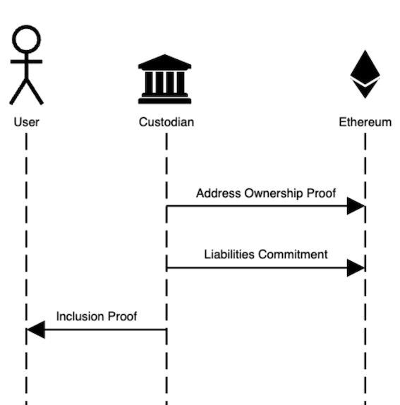
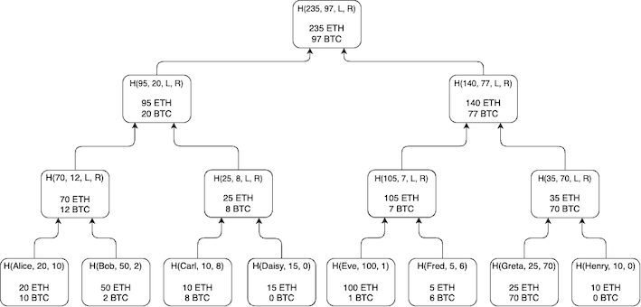
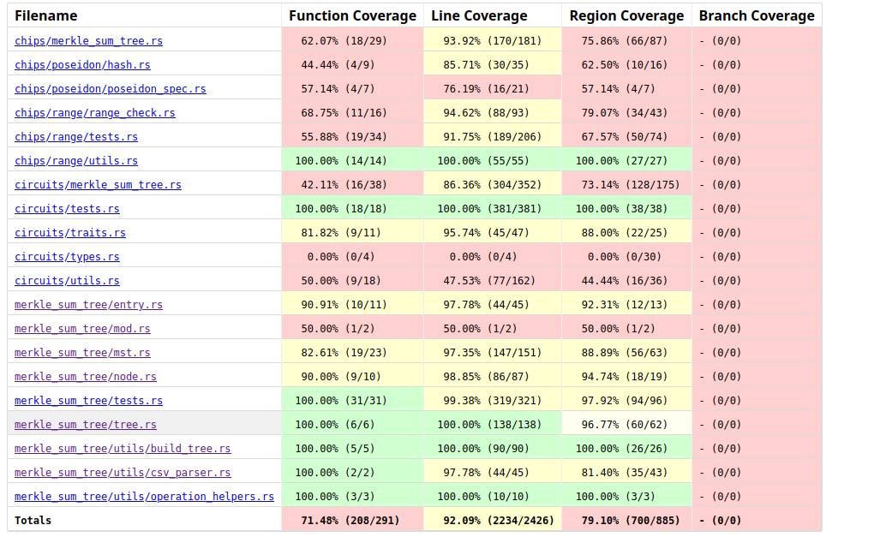

# yAudit Summa Review - MST-based Protocol

Auditors:

- [0xKarl98](https://github.com/0xKarl98)
- [0xpanicError](https://github.com/0xpanicError)
- [parsely](https://github.com/bbresearcher)
- [flyingnobita](https://github.com/flyingnobita)
- [hrishibhat](https://github.com/hrishibhat)
- [igorline](https://github.com/igorline)
- [irnb](https://github.com/irnb)
- [kiseln](https://github.com/kiseln)
- [nullity](https://github.com/nullity00)
- [obatirou](https://github.com/obatirou)
- [qpzm](https://github.com/qpzm)
- [rkdud007](https://github.com/rkdud007)
- [sachindkagrawal15](https://github.com/sachindkagrawal15)
- [sebastiantf](https://github.com/sebastiantf)
- [teddav](https://github.com/teddav)
- [thogiti](https://github.com/thogiti)
- [Y5Yash](https://github.com/Y5Yash)
- [yagnadeepxo](https://github.com/yagnadeepxo)
- [zeroqn](https://github.com/zeroqn)
- [zzzuhaibmohd](https://github.com/zzzuhaibmohd)

# Table of Contents

- [Protocol Summary](#protocol-summary)
  - [Overview of the Summa Proof of Solvency Protocol](#overview-of-the-summa-proof-of-solvency-protocol)
  - [Overview of the MST-based implementation of Summa Solvency (Version A)](#overview-of-the-mst-based-implementation-of-summa-solvency-version-a)
- [Scope](#scope)
  - [Audit Objectives and Components](#audit-objectives-and-components)
  - [Scope of Files and Folders](#scope-of-files-and-folders)
  - [Methodology](#methodology)
- [Code Evaluation Matrix](#code-evaluation-matrix)
- [Automated Testing](#automated-testing)
  - [Automated Analysis](#automated-analysis)
  - [Fuzz Testing](#fuzz-testing)
  - [Code Coverage](#code-coverage)
- [Findings](#findings)
  - [Findings Explanation](#findings-explanation)
  - [High](#high)
    - [1. High: Missing username range check in `big_intify_username` \& `big_uint_to_fp`](#1-high-missing-username-range-check-in-big_intify_username--big_uint_to_fp)
    - [2. High: Sum Balance Overflow](#2-high-sum-balance-overflow)
    - [3. High: Inconsistency in range checks](#3-high-inconsistency-in-range-checks)
  - [Low](#low)
    - [1. Low: Mixed endian usage in code](#1-low-mixed-endian-usage-in-code)
  - [Informational](#informational)
    - [1. Informational: Range check uses lookup_any instead of lookup](#1-informational-range-check-uses-lookup_any-instead-of-lookup)
    - [2. Informational: `InclusionVerifier.yul`not generated](#2-informational-inclusionverifieryulnot-generated)
    - [3. Informational: Improvement to public inputs in contract](#3-informational-improvement-to-public-inputs-in-contract)
    - [4. Informational: Use only mapping for `addressOwnershipProofs`](#4-informational-use-only-mapping-for-addressownershipproofs)
    - [5. Informational: `Summa.sol` : Improvements to generating the `addressHash`](#5-informational-summasol--improvements-to-generating-the-addresshash)
    - [6. Informational: `Summa.sol` : Ownable: Does not implement 2-Step-Process for transferring ownership](#6-informational-summasol--ownable-does-not-implement-2-step-process-for-transferring-ownership)
    - [7. Informational: `Summa.sol` : Potential `Summa::submitCommitment()` Gas limits](#7-informational-summasol--potential-summasubmitcommitment-gas-limits)
    - [8. Informational: Use constants to denote magic numbers in PoseidonChip](#8-informational-use-constants-to-denote-magic-numbers-in-poseidonchip)
    - [9. Informational: Informational: Missing validation for `timestamp`, `mstLevels` and `currenciesCount`](#9-informational-missing-validation-for-timestamp-mstlevels-and-currenciescount)
- [Final remarks](#final-remarks)
- [Appendix](#appendix)
  - [A - Automated Analysis](#a---automated-analysis)
    - [1. Halo2-analyzer](#1-halo2-analyzer)
    - [2. Polyexen-demo](#2-polyexen-demo)
    - [3. NPM Audit](#3-npm-audit)
    - [4. Cargo Audit](#4-cargo-audit)
    - [5. Clippy](#5-clippy)
  - [B - Fuzz Testing](#b---fuzz-testing)
  - [C - Code Coverage](#c---code-coverage)

# Protocol Summary

## Overview of the Summa Proof of Solvency Protocol

Blockchain technology can facilitate uncensorable and self-sovereign control of one’s assets. Users nonetheless regularly transfer ownership of their assets to centralized entities for various needs, chief among which is trading of cryptocurrencies and the on/off-ramping of fiat. Such centralized entities may themselves and in turn transfer ownership to secondary specialized custodian entities or other service providers such as investment funds. Unfortunately, such centralized control and handling of user funds can lead to catastrophic situations such as the mishandling of private keys which may lead to internal or external hacks, or the outright misuse of funds for trading or for use as collateral to access capital -which can result in liquidations in extreme market conditions.

From the user's point of view, they only see a promise from the centralized entity that they hold their funds. But this only represents entries in an accounting database, and may or may not reflect the state of wallets that are under the control of the centralized entity. The perennial question is: are all user funds available and liquid for immediate withdrawal at a given moment in time?

Summa takes an approach that focuses on binding the custodian to a certain claim about the sum of their liabilities to their users, and subsequently leveraging zero-knowledge and cryptographic primitives to prove that the assets under their control are equal or exceed that sum of liabilities. In other words, rather than focusing on proving reserves, as in "we the entity control the private key(s) of wallets holding the pooled deposits of users", Summa focuses on binding liabilities, as in "we the entity prove to each user that their balance is included in calculating a grand sum of all liabilities, and we prove control of wallets that contain funds equal or exceeding that aggregated balance of liabilities".

Summa’s two-sided mechanism that overall provides a proof of solvency of an entity provides two useful proofs:

(a) **Proof of grand sums**: the centralized entity submits a public cryptographic [commitment](https://github.com/summa-dev/summa-solvency/blob/52373464b7ac4e76f7601cd51a10f84655ad387f/contracts/src/Summa.sol#L144) claiming the sum of each asset in wallets it controls is greater than or equal a _claimed_ total sum of _liabilities_ to its users in that asset. In the KZG-based Version B of the protocol, a [proof is attached](https://github.com/summa-dev/summa-solvency/blob/fec83a747ead213261aecfaf4a01b43fff9731ee/contracts/src/Summa.sol#L230) to the commitment attesting it was calculated correctly.

(b) **Inclusion proofs**: Multiple proofs to users, one for each user, that their exact balances were included in the calculation of the grand sum. The more users verify their individual proof of inclusion of their exact balances of each asset (a proof which is cryptographically tied to the overall proof in (a)), the more confidence there is that the _claimed_ total of liabilities used in (a) was truthful, thereby proving the solvency of the entity overall.

The more users verify their proof of inclusion in (b) the more trust the public at large can put in the proof of grand sums in (a). A custodian may incentivise wide verification of inclusion by users through the use of lottery where in each round of verification, say weekly or monthly, certain users are selected randomly to win a monetary reward.



Figure 1: General flow of the Summa protocol in both variants, _credit: [Enrico - Summa tech lead](https://docs.google.com/presentation/d/1xUcH8geMz6I1iD9Jx0kWsIZvUcVlii5Us3mM4Mb3HNg/edit#slide=id.p3)_

The proof in (a) further represents a trap-door commitment vis-à-vis the user who will verify their individual inclusion proofs against it. The zkSNARKs bring two benefits:

- **Privacy** against the leakage of user data. In verifying proofs of grand sums, the public input are the leaf and root hashes.
- **Validity** of the computation of aggregated balances.

The core of Summa protocol has been implemented in two variants that use different cryptographic primitives to generate the aforementioned proofs. However, the overall flow of the protocol (Figure 1) and assumptions and guarantees on security and privacy remain the same in both variants.

## Overview of the MST-based Implementation of Summa Solvency (Version A)

The core object in this version of the protocol is a Merkle sum tree (MST). Nodes in the tree all have two elements: a `hash`, and an array of `balances[b0, b1, .., bN]` where `N` is a global constant hardcoded to each instantiation of the protocol. In leaf nodes, the hash is `H(user_id_transposed_into_a_field_element, [balances])`, while in middle nodes and the root, the hash is `H([balances], left_child_hash, right_child_hash)`. A balance b_i in a leaf node represents a user’s balance of the `i-th` currency, while in a non-leaf node in the tree it represents the aggregated sum of the `i-th` currency in all leaves that are descendants of said inner (or root) node. The ZK-friendly Poseidon hash function is used.



Figure 1: Merkle sum tree in [Summa Version A](https://summa.gitbook.io/summa/v/1/cryptographic-primitives/merkle-sum-tree)

User IDs are hashed in leaf nodes, and the root node (like all other inner nodes) contains only a hash an array of balances. The root hash and the aggregated `rootBalances` are the public inputs to the commitment from the CEX and as such no private user data are leaked. Merkle roots provided to users to feed as public input to the verifier of their inclusion proofs also do not leak any private data of other users for the same reason -blinding by hashing.

What is proven in-circuit by the entity are:

- The values of balances are valid and within the proper range, to combat potential attacks by overflowing the prime of the field
- The arithmetic of summation is valid
- The hash function is computed correctly

Each balance is range-checked in-circuit to a ceiling such that summing N users cannot possibly exceed the prime, with N being a safe maximum. The larger the ceiling the higher the prover cost (due to more decompositions during range-check). In Summa, balances are range-checked to be ≤ 64 bits which are large enough for typical cryptocurrency balances while small enough to guarantee the summation of billions of users `N` cannot possibly overflow the much larger prime.

# Scope

This section outlines the comprehensive scope of the security audit conducted for Summa’s Proof of Solvency Protocol, encompassing versions V_A. The objective of this audit was to evaluate the security, reliability, and integrity of the protocol’s codebase, with an emphasis on its implementation of zero-knowledge proofs.

### Audit Objectives and Components

The security audit of the Summa Proof of Solvency protocol encompassed a comprehensive review aimed at enhancing the protocol’s security and reliability. Here are the streamlined objectives and components of the audit:

- **Codebase Security**: Evaluate source code to identify vulnerabilities, assess file organization, and ensure coding best practices.
- **Protocol Logic and Flow**: Analyze and verify the logical operations and data flows of the protocol for consistency and operational integrity.
- **Security Mechanisms**: Examine authentication, authorization, cryptographic practices, and smart contract security to bolster protocol defenses.
- **Zero-Knowledge Proof Assessment**: Critically evaluate the implementation of zero-knowledge proofs, focusing on algorithm efficiency, proof verification, and privacy safeguards.
- **Testing and Documentation**: Ensure thorough testing across all protocol components and review documentation for completeness and accuracy.

### Scope of Files and Folders

- **Commit hash**: [95d63fe1a55935542810138aa5d8de7f50f4e94b](https://github.com/summa-dev/summa-solvency/tree/95d63fe1a55935542810138aa5d8de7f50f4e94b)
- **Included**:
  - `/zk_prover/*`
  - `/contracts/src/Summa.sol`
  - `/backend/*`
- **Excluded**:
  - `/contracts/src/InclusionVerifier.sol`
  - Examples related to Nova experiments
  - `/src/circom/*`

### Methodology

The audit employed a blend of automated tools and manual examination conducted by the fellows and residents. Techniques included detailed code reviews, static and dynamic analysis, fuzzing, and penetration testing to ensure a thorough validation of the protocol’s security measures.

- **Tool Integration:**
  The audit utilized several specialized tools, each tailored to assess different aspects of the protocol:
  - **Halo2-analyzer**: Verified all circuit constraints.
  - **Polyexen-demo**: Standardized circuit formats for clarity and reusability.
  - **Misc Tools**: Utilized Highlighter to identify potential code issues, conducted NPM and Cargo Audits to check for vulnerabilities, and Clippy to ensure Rust code quality and best practices.
- **Analytical Techniques:**
  The audit encompassed both static and dynamic analyses to provide a comprehensive security assessment:
  - **Static Analysis**: Examined the source code for vulnerabilities without execution.
  - **Dynamic Analysis**: Tested the protocol in operation to identify runtime issues.
- **Expert Review:**
  We conducted in-depth manual reviews to evaluate complex components and integrations, providing a crucial layer of scrutiny beyond automated tools.
- **Feedback and Improvements:**
  An iterative feedback loop with the Summa’s development team allowed for the immediate addressing and re-evaluation of any issues found, ensuring all fixes were effectively implemented.
- **Documentation:**
  Each phase of the audit was thoroughly documented, with detailed reports on tool outputs, expert insights, and overall findings, culminating in a comprehensive final report that outlined vulnerabilities, impacts, and recommended actions.

After the findings were presented to the Summa team, fixes were made and included in several PRs.

This code review is for identifying potential vulnerabilities in the code. The reviewers did not investigate security practices or operational security and assumed that privileged parties could be trusted. The reviewers did not evaluate the security of the code relative to a standard or specification. The review may not have identified all potential attack vectors or areas of vulnerability.

yAudit and the auditors make no warranties regarding the security of the code and do not warrant that the code is free from defects. yAudit and the auditors do not represent or imply to third parties that the code has been audited or that the code is free from defects. By deploying or using the code, Summa Solvency and users of the contracts/circuits agree to use the code at their own risk.

## Code Evaluation Matrix

---

| Category                 | Mark    | Description                                                                                                                                                                                                                                                                                                                                                                                                                                                                                                                                                                                                                                                                                                                                                                                                                             |
| ------------------------ | ------- | --------------------------------------------------------------------------------------------------------------------------------------------------------------------------------------------------------------------------------------------------------------------------------------------------------------------------------------------------------------------------------------------------------------------------------------------------------------------------------------------------------------------------------------------------------------------------------------------------------------------------------------------------------------------------------------------------------------------------------------------------------------------------------------------------------------------------------------- |
| Mathematics              | Good    | No significant mathematical components were involved                                                                                                                                                                                                                                                                                                                                                                                                                                                                                                                                                                                                                                                                                                                                                                                    |
| Complexity               | Good    | The code is easy to understand and closely follows the specification                                                                                                                                                                                                                                                                                                                                                                                                                                                                                                                                                                                                                                                                                                                                                                    |
| Libraries                | Low     | Although no serious issues have been found in the dependencies, the codebase makes use of unaudited versions of [halo2](https://github.com/summa-dev/halo2) , [halo2-kzg-srs](https://github.com/han0110/halo2-kzg-srs), and [halo2-solidity-verifier](https://github.com/summa-dev/halo2-solidity-verifier), which is not recommended for production                                                                                                                                                                                                                                                                                                                                                                                                                                                                                   |
| Cryptography             | Good    | Merkle Sum Trees inherit strong cryptographic properties from the hash functions used. Here, the codebase makes use of the Poseidon hash function known for its efficiency, zk-friendliness, and resistance against various cryptanalytic attacks. Even with a change in its magic numbers, the hash function yields a security of `127 bits`. However, it's essential to note that cryptographic algorithms and functions are always subject to ongoing analysis, and new attacks or weaknesses may be discovered in the future.                                                                                                                                                                                                                                                                                                       |
| Code stability           | Good    | The code was reviewed at a specific commit. The code did not change during the review. Moreover, it is not likely to change significantly with addition of features or updates                                                                                                                                                                                                                                                                                                                                                                                                                                                                                                                                                                                                                                                          |
| Documentation            | Good    | Summa codebase comprises a centralized and up-to-date [Gitbook documentation](https://summa.gitbook.io/summa/v/1). However, we recommend aggregating the limitations and the attack vectors of the Summa Protocol in the documentation. We found only one discrepancy with regards to the documentation here [Informational#2](#2-informational-inclusionverifieryulnot-generated).                                                                                                                                                                                                                                                                                                                                                                                                                                                     |
| Monitoring               | N/A     | The protocol is intended to be integrated by other systems or dApps which will be responsible for the monitoring                                                                                                                                                                                                                                                                                                                                                                                                                                                                                                                                                                                                                                                                                                                        |
| Testing and verification | Average | The protocol contains only a few tests for the circuits. It is recommended to add more tests to increase the test coverage. When it comes to circuits, we believe it is necessary to develop an adversarial testing process, especially focused on malicious prover behavior. We raised the following PRs to increase code coverage & emphasize testing - [#3](https://github.com/electisec/summa-solvency-diffie/pull/3), [#5](https://github.com/electisec/summa-solvency-schneier/pull/5), [#8](https://github.com/electisec/summa-solvency-schneier/pull/8/files), [#17](https://github.com/electisec/summa-solvency-schneier/pull/17). We also recommend [fuzz testing](#fuzz-testing) and incorporating tools we used in [Automated Testing](#automated-testing) in Summa's software development lifecycle to produce secure code |

# Automated Testing

We use automated techniques to extensively test the security properties of software. We use both open-source static analysis and fuzzing utilities, along with tools developed in house, to perform automated testing of source code.

## Automated Analysis

We used the following tools in the automated testing phase of this project:

| Tool                                                           | Description                                                                                                                                                                                                                                                           | Section                           |
| -------------------------------------------------------------- | --------------------------------------------------------------------------------------------------------------------------------------------------------------------------------------------------------------------------------------------------------------------- | --------------------------------- |
| [Halo2-analyzer](https://github.com/quantstamp/halo2-analyzer) | Halo2-analyzer / Korrekt employs a Satisfiability Modulo Theories (SMT) solver to try to find multiple satisfying models (i.e., private inputs) for a circuit and a (fixed) public input in order to determine if it is under-constrained.                            | [Appendix A.1](#1-halo2-analyzer) |
| [Polyexen-demo](https://github.com/ed255/polyexen-demo)        | Polyexen (Polynomial Expression Engine) transforms circuits designed with the Halo2 API into the Plonkish Arithmetization Format (Plaf). Plaf is designed to standardize plonkish circuits for reuse in components compatible with plonkish arithmetization.          | [Appendix A.2](#2-polyexen-demo)  |
| [npm-audit](https://docs.npmjs.com/cli/v10/commands/npm-audit) | `npm audit` scans your project's dependencies for known security vulnerabilities, reports them with severity levels, and suggests fixes. It helps keep your Node.js application secure by identifying and addressing potential risks in your packages.                | [Appendix A.3](#3-npm-audit)      |
| [cargo-audit](https://crates.io/crates/cargo-audit)            | `cargo audit` scans your Rust project's dependencies for known security vulnerabilities, reports them with severity levels, and suggests fixes. It helps keep your Rust application secure by identifying and addressing potential risks in your crates.              | [Appendix A.4](#4-cargo-audit)    |
| [clippy](https://doc.rust-lang.org/clippy/)                    | `clippy` is a linter for Rust that checks your code for common mistakes and style issues. It provides helpful suggestions to improve your code quality and maintainability. Using clippy helps ensure your Rust code is clean, efficient, and follows best practices. | [Appendix A.5](#5-clippy)         |

## Fuzz Testing

Fuzzing is a testing technique that tries to find bugs by repeatedly executing test cases and
mutating them. Classically, it is used in C/C++ codebases to detect segmentation faults,
buffer overflows, and other memory corruption vulnerabilities. In Rust, we can use it to find
runtime errors.

We set up a fuzz test suite using `cargo fuzz` for Merkle Sum Tree implementation, Range check & it’s utilities. [Appendix B](#b---fuzz-testing) contains a detailed description of the setup and deployment details.

## Code Coverage

We used [cargo-llvm-cov](https://github.com/taiki-e/cargo-llvm-cov) to generate LLVM source-based code coverage. Refer to [Appendix C](#c---code-coverage) for more detailed information on testing & code coverage.

# Findings

## Findings Explanation

Findings are broken down into sections by their respective Impact:

- Critical, High, Medium, Low Impact
  - These findings range from attacks that may cause loss of funds, a break in the soundness, zero-knowledge, or completeness of the system, proof malleability, or any unintended consequences/actions that are outside the scope of the requirements
- Informational
  - Findings including Recommendations and best practices

---

## High

## 1. High: Missing username range check in `big_intify_username` & `big_uint_to_fp`

```rust
/// Return a BigUint representation of the username
pub fn big_intify_username(username: &str) -> BigUint {
    let utf8_bytes = username.as_bytes();
    BigUint::from_bytes_be(utf8_bytes)
}
/// Converts a BigUint to a Field Element
pub fn big_uint_to_fp(big_uint: &BigUint) -> Fp {
    Fp::from_str_vartime(&big_uint.to_str_radix(10)[..]).unwrap()
}
```

A malicious prover could create usernames that overflow if two users have the same balance thus they can exclude one of the records from the data.

We recommend that a range check is done inside the circuit or inside the smart contract. The range checks are to ensure that all usernames are less than the SNARK scalar field order so that two users don't end up with the same identity in the Merkle sum tree

#### Refer

- [Guarantee usernames stays inside field](https://github.com/electisec/summa-solvency-schneier/issues/13) by [sebastiantf](https://github.com/sebastiantf)
- [Possible Overflow in username in big_intify_username combined with calling big_uint_to_fp](https://github.com/electisec/summa-solvency-diffie/issues/16) by [parsley](https://github.com/bbresearcher)

## 2. High: Sum Balance Overflow

The lack of in-circuit range check for the sum of balances posesses a risk of overflow. Since `N_BYTES` is not exposed in the contract, users must run `examples/gen_inclusion_verifier.rs` to obtain a warning message about the risk of overflow when `N_BYTES` is set to 32.

#### Refer

- [Sum Balance Overflow](https://github.com/electisec/summa-solvency-diffie/issues/10) by [zeroqn](https://github.com/zeroqn)

## 3. High: Inconsistency in range checks

The circuit checks for all levels in the tree if the sibling node's balance (and two leaf balances) is less than `m = 2 ** (NBYTES * 8)`. In the first look, this suggests that the max balance for the immediate parent of the leaf nodes at level 1 would be `2 * m` and the parent at level 2 would be `3 * m`, ..., and the max balance at the root will be `(NLEVEL - 1) * m`.

Root's max balance is `(NLEVEL - 1) * m` as can be inferred from circuits/contracts.

#### Refer

- [Inconsistency in range checks](https://github.com/electisec/summa-solvency-Turing/issues/14) by [y5yash](https://github.com/Y5Yash)

## Low

## 1. Low: Mixed endian usage in code

```rust
/// Return a BigUint representation of the username
pub fn big_intify_username(username: &str) -> BigUint {
    let utf8_bytes = username.as_bytes();
    BigUint::from_bytes_be(utf8_bytes)
}
/// Converts a BigUint to a Field Element
pub fn big_uint_to_fp(big_uint: &BigUint) -> Fp {
    Fp::from_str_vartime(&big_uint.to_str_radix(10)[..]).unwrap()
}

/// Converts a Field element to a BigUint
pub fn fp_to_big_uint(f: Fp) -> BigUint {
    BigUint::from_bytes_le(f.to_bytes().as_slice())
}
```

In the code [here](https://github.com/summa-dev/summa-solvency/blob/master/zk_prover/src/merkle_sum_tree/utils/operation_helpers.rs#L5-L17), `big_intify_username` uses big-endian and `fp_to_big_uint` uses little-endian.

#### Refer

- [Mixed endian usage in code](https://github.com/electisec/summa-solvency-diffie/issues/17) by [parsely](https://github.com/bbresearcher)

## Informational

## 1. Informational: Range check uses `lookup_any` instead of lookup

The [range check](https://github.com/summa-dev/summa-solvency/blob/52373464b7ac4e76f7601cd51a10f84655ad387f/zk_prover/src/chips/range/range_check.rs#L71) uses function `lookup_any` which was introduced in PSE fork to allow dynamic lookup by using a table expression. The table used for the range check do not change and is always the same: values from `0 to 2^8-1.` Hence, a dynamic lookup is not necessary in this context. The usage of `lookup` should be preferred.

#### Refer

- [Range check uses lookup_any instead of lookup](https://github.com/electisec/summa-solvency-schneier/issues/18) By [obatirou](https://github.com/obatirou)

## 2. Informational: `InclusionVerifier.yul`not generated

> The script will generate a new `InclusionVerifier.sol` and `InclusionVerifier.yul` contracts in [`contracts/src`](https://github.com/summa-dev/summa-solvency/tree/master/contracts/src).

It is mentioned in the Summa Book on the [summa-solvency page](https://summa.gitbook.io/summa-book/backend/summa-solvency) that `InclusionVerifier.sol` and `InclusionVerifier.yul` will be generated by the `gen_inclusion_verifier.rs` script. However, only `InclusionVerifier.sol` is generated.

#### Refer

- [`InclusionVerifier.yul`not generated](https://github.com/electisec/summa-solvency-schneier/issues/16) by [flyingnobita](https://github.com/flyingnobita)

## 3. Informational: Improvement to public inputs in contract

The [`publicInputs`](https://github.com/electisec/summa-solvency/blob/95d63fe1a55935542810138aa5d8de7f50f4e94b/contracts/src/Summa.sol#L193) input to the contract is taken as an array. But its not a homogenous array. The expected [public inputs](https://summa.gitbook.io/summa-book/circuits/merkle-sum-tree-inclusion#public-inputs-outputs) are: user leaf hash, MST root followed by root balances: [Refer #L188-L197](https://github.com/electisec/summa-solvency/blob/95d63fe1a55935542810138aa5d8de7f50f4e94b/contracts/src/Summa.sol#L188-L197)

Since they are not homogenous or not values that have the same meaning, it might be better DX/UX to have them as separate meaningful inputs and combine them into an array within the function before submitting them to the verifier.

#### Refer

- [Improvement to public inputs in contract](https://github.com/electisec/summa-solvency-schneier/issues/12) By [sebastiantf](https://github.com/sebastiantf)

## 4. Informational: Use only mapping for `addressOwnershipProofs`

Currently both the array [`addressOwnershipProofs`](https://github.com/electisec/summa-solvency/blob/95d63fe1a55935542810138aa5d8de7f50f4e94b/contracts/src/Summa.sol#L68) and the mapping [`_ownershipProofByAddress`](https://github.com/electisec/summa-solvency/blob/95d63fe1a55935542810138aa5d8de7f50f4e94b/contracts/src/Summa.sol#L83C41-L83C65) are being used to track address ownership proofs. But the use of both seems unnecessary, inefficient and error-prone. Storing address proofs on chain when the rounds become much more frequent would be highly inefficient.

We recommend removing the array, modifying the mapping to store the `AddressOwnershipProof` struct as an efficient and simpler alternative.

#### Refer

- [Use only mapping for `addressOwnershipProofs`](https://github.com/electisec/summa-solvency-schneier/issues/11) by [sebastiantf](https://github.com/sebastiantf)

## 5. Informational: `Summa.sol` : Improvements to generating the `addressHash`

The hash calculation of the `cexAddress` at [Summa.sol#L117](https://github.com/electisec/summa-solvency-schneier/blob/95d63fe1a55935542810138aa5d8de7f50f4e94b/contracts/src/Summa.sol#L117) does not take into consideration the chain of the address. Considering a multi chain architecture, using at least two distinct identifiers for generating the hash enhances security and prevents potential collisions or misuse.

#### Refer

- [`Summa.sol` : Issue with `submitProofOfAddressOwnership()`](https://github.com/electisec/summa-solvency-schneier/issues/7) by [zzzuhaibmohd](https://github.com/zzzuhaibmohd)

## 6. Informational: `Summa.sol` : Ownable: Does not implement 2-Step Process for transferring ownership

The contracts `Summa.sol` does not implement a 2-Step-Process for transferring ownership.
So ownership of the contract can easily be lost when making a mistake when transferring ownership.

While the probability of this happening is highly unlikely, we recommend following the best security measures.

#### Refer

- [`Summa.sol` : Ownable: Does not implement 2-Step-Process for transferring ownership](https://github.com/electisec/summa-solvency-schneier/issues/6) by [zzzuhaibmohd](https://github.com/zzzuhaibmohd)

## 7. Informational: Summa.sol : Potential `Summa::submitCommitment()` Gas limits

[`Summa::submitCommitment()`](https://github.com/electisec/summa-solvency/blob/main/contracts/src/Summa.sol#L144) takes in two arrays and loops once over them. [`rootBalances`](https://github.com/electisec/summa-solvency-schneier/blob/95d63fe1a55935542810138aa5d8de7f50f4e94b/contracts/src/Summa.sol#L146-L147) array contains the root balances of each cryptocurrency. [`cryptocurrencies`](https://github.com/electisec/summa-solvency/blob/95d63fe1a55935542810138aa5d8de7f50f4e94b/contracts/src/Summa.sol#L159-L171) array contains details of each cryptocurrency: `name`, `chain`. There could be practical limitations to the number of `rootBalances` and `cryptocurrencies` that could be submitted in a single txn, imposed by block gas limits

According to [Coingecko](https://www.coingecko.com/en/exchanges/binance), Binance hosts 376 cryptocurrencies. After a stress test in [PR#5](https://github.com/electisec/summa-solvency-schneier/pull/5), it is known that 402 is the maximum number of cryptocurrencies before overflowing 30M block gas limit. To compute proof of solvency for the entire state of the exchange at a given time, it might be necessary to split the submission into multiple commitments for the same `timestamp`.

#### Refer

- [Potential `Summa::submitCommitment()` Gas limits](https://github.com/electisec/summa-solvency-schneier/issues/4) by [sebastiantf](https://github.com/sebastiantf)
- [test: submitting large no. of cryptocurrencies in single commitment](https://github.com/electisec/summa-solvency-schneier/pull/5) by [sebastiantf](https://github.com/sebastiantf)

## 8. Informational: Use constants to denote magic numbers in PoseidonChip

```rust
let poseidon_entry_chip =
    PoseidonChip::<PoseidonSpec, 2, 1, { N_CURRENCIES + 1 }>::construct(
        config.poseidon_entry_config,
    );
```

The [Poseidon chip](https://github.com/summa-dev/summa-solvency/blob/master/zk_prover/src/circuits/merkle_sum_tree.rs#L237-L245) currently uses hardcoded integers to denote `WIDTH` and `RATE` of the Poseidon Hash. We recommend using named constants and documenting the values in a comment.

#### Refer

- [Magic numbers used in code of MST Circuit to create PoseidonChip](https://github.com/electisec/summa-solvency-diffie/issues/15) by [parsely](https://github.com/bbresearcher)

## 9. Informational: Missing validation for `timestamp`, `mstLevels` and `currenciesCount`

```javascript
    function submitCommitment(
        uint256 mstRoot,
        uint256[] memory rootBalances,
        Cryptocurrency[] memory cryptocurrencies,
        uint256 timestamp // @audit : Future timestamp can be used. This can be used to manipulate
```

`timestamp` is expected to be the time at which the exchange has taken snapshot of all the balances but this `timestamp` is not validated. This may lead to potential manipulations by the exchange owner by combining off-chain and on-chain processes.

- Inconsistencies/confusion by not maintaining a chronological order in the commitment.
- Delaying the proof verification by promising a future commitment.

To mitigate this, add the following validation checks to the timestamp :

- Add a check to ensure the timestamp is not in the future.
- Store the last submitted timestamp and check the new timestamp is larger than the previous timestamp.

```diff
+ uint256 public lastSubmitted;

    function submitCommitment(
        uint256 mstRoot,
        uint256[] memory rootBalances,
        Cryptocurrency[] memory cryptocurrencies,
        uint256 timestamp
    ) public onlyOwner {
        require(mstRoot != 0, "Invalid MST root");
+       require(timestamp < block.timestamp, "Cannot submit future commitment");
+        require(timestamp > lastSubmitted, "Incorrect timestamp");
        lastSubmitted = timestamp;
        ....
```

Likewise we would also need the following checks :

- `require(cryptocurrencies.length <= currenciesCount, "Exceeds currency count");` to ensure that submitted commitment's currencies stay in range
- `mst levels` resulting out of the `rootBalances/currenciesCount` does not exceed the configured `mstLevels`

#### Refer

- [Review of the `Summa.sol` smart contract](https://github.com/electisec/summa-solvency-diffie/issues/12) by [hrishibhat](https://github.com/hrishibhat)

# Final remarks

- The Summa Solvency Protocol assumes that :
  - Poseidon hash function is collision-resistant, resistant to differential, algebraic, and interpolation attacks.
  - The Merkle Sum Tree is a cryptographic structure which inherits the security properties of the Poseidon hash function
- Social engineering attacks are still a valid way to break the system. The custodian could omit a section of users who do not verify their inclusion proofs.
- The library used for trusted setup - [halo2-kzg-srs](https://github.com/han0110/halo2-kzg-srs) is unaudited & it's contents are unreliable as there is no checksum available to validate its contents
- Overall, the code demonstrates good implementation of mathematical operations and basic functionality. However, it could benefit from more extensive documentation, testing and additional tools such as [polyexen](https://github.com/electisec/summa-solvency-diffie/pull/5) to view cell data.

# Appendix

## A - Automated Analysis

### 1. Halo2-analyzer

Halo2-analyzer / Korrekt employs a Satisfiability Modulo Theories (SMT) solver to try to find multiple satisfying models (i.e., private inputs) for a circuit and a (fixed) public input in order to determine if it is under-constrained. It works by collecting all the gates and regions using a custom implementation (`AnalyticLayouter`) of the `Layouter` trait. For every `region`, we have a set of enabled selectors and assigned cells (but with dummy values), likewise for every `gate`, we have a set of polynomials for each gate. This simple tool performs three checks :

- **Unused Gate -** Check that for every gate there exists a region in which it is not identically zero.
- **Unused Column -** Check that every column occurs in some polynomial.
- **Unconstrained Cell -** Check that for every assigned cell in the region, it occurs in a polynomial which is not identically zero over this region. This means that part of the witness is not constrained -- this is almost certainly a bug.

We used halo2-analyzer to search for unused gates, unconstrained cells and unused columns in the circuits. Here are the results :

1. Unused Gate

```bash
Finished analysis: 2 unused gates found.
unused gate: "partial rounds" (consider removing the gate or checking selectors in regions)
unused gate: "partial rounds" (consider removing the gate or checking selectors in regions)
```

The gate [`partial rounds`](https://github.com/summa-dev/halo2/blob/main/halo2_gadgets/src/poseidon/pow5.rs#L117) is defined in the `Pow5Chip` of the Poseidon circuit. Since, the gate isn’t used, it is recommended that the gate be removed.

2. Unused Columns

```bash
Finished analysis: 0 unused columns found.
```

3. Unconstrained Cell

```bash
Finished analysis: 3566 unconstrained cells found.
unconstrained cell in "assign entry username" region: Column { index: 0, column_type: Advice } (rotation: 0) -- very likely a bug.
unconstrained cell in "assign entry balance" region: Column { index: 1, column_type: Advice } (rotation: 0) -- very likely a bug.
unconstrained cell in "assign entry balance" region: Column { index: 1, column_type: Advice } (rotation: 0) -- very likely a bug.
unconstrained cell in "initial state for domain ConstantLength<3>" region: Column { index: 1, column_type: Advice } (rotation: 0) -- very likely a bug.
unconstrained cell in "initial state for domain ConstantLength<3>" region: Column { index: 0, column_type: Advice } (rotation: 0) -- very likely a bug.
unconstrained cell in "permute state" region: Column { index: 0, column_type: Advice } (rotation: 0) -- very likely a bug.
...
unconstrained cell in "assign sibling leaf node username" region: Column { index: 0, column_type: Advice } (rotation: 0) -- very likely a bug.
unconstrained cell in "assign sibling leaf balance" region: Column { index: 1, column_type: Advice } (rotation: 0) -- very likely a bug.
unconstrained cell in "initial state for domain ConstantLength<3>" region: Column { index: 1, column_type: Advice } (rotation: 0) -- very likely a bug.
unconstrained cell in "initial state for domain ConstantLength<3>" region: Column { index: 0, column_type: Advice } (rotation: 0) -- very likely a bug.
unconstrained cell in "permute state" region: Column { index: 1, column_type: Advice } (rotation: 0) -- very likely a bug.
...
unconstrained cell in "sum nodes balances per currency" region: Column { index: 0, column_type: Advice } (rotation: 0) -- very likely a bug.
unconstrained cell in "initial state for domain ConstantLength<4>" region: Column { index: 0, column_type: Advice } (rotation: 0) -- very likely a bug.
unconstrained cell in "initial state for domain ConstantLength<4>" region: Column { index: 1, column_type: Advice } (rotation: 0) -- very likely a bug.
unconstrained cell in "permute state" region: Column { index: 1, column_type: Advice } (rotation: 0) -- very likely a bug.
...
unconstrained cell in "assign value to perform range check" region: Column { index: 0, column_type: Advice } (rotation: 0) -- very likely a bug.
unconstrained cell in "sum nodes balances per currency" region: Column { index: 0, column_type: Advice } (rotation: 0) -- very likely a bug.
unconstrained cell in "initial state for domain ConstantLength<4>" region: Column { index: 1, column_type: Advice } (rotation: 0) -- very likely a bug.
unconstrained cell in "initial state for domain ConstantLength<4>" region: Column { index: 0, column_type: Advice } (rotation: 0) -- very likely a bug.
unconstrained cell in "permute state" region: Column { index: 0, column_type: Advice } (rotation: 0) -- very likely a bug.
...
unconstrained cell in "assign sibling node balance" region: Column { index: 1, column_type: Advice } (rotation: 0) -- very likely a bug.
unconstrained cell in "assign sibling node balance" region: Column { index: 1, column_type: Advice } (rotation: 0) -- very likely a bug.
unconstrained cell in "assign sibling left hash" region: Column { index: 2, column_type: Advice } (rotation: 0) -- very likely a bug.
unconstrained cell in "assign sibling right hash" region: Column { index: 2, column_type: Advice } (rotation: 0) -- very likely a bug.
unconstrained cell in "initial state for domain ConstantLength<4>" region: Column { index: 1, column_type: Advice } (rotation: 0) -- very likely a bug.
unconstrained cell in "initial state for domain ConstantLength<4>" region: Column { index: 0, column_type: Advice } (rotation: 0) -- very likely a bug.
unconstrained cell in "permute state" region: Column { index: 2, column_type: Advice } (rotation: 0) -- very likely a bug.
unconstrained cell in "permute state" region: Column { index: 1, column_type: Advice } (rotation: 0) -- very likely a bug.
unconstrained cell in "permute state" region: Column { index: 1, column_type: Advice } (rotation: 0) -- very likely a bug.
```

Out of the `3566` unconstrained cells found, these are the common weaknesses pointed out :

- unconstrained cell in `"assign entry username"`, `"assign entry balance"`, `"assign sibling leaf node username"`, `"assign sibling leaf balance"`, `"assign sibling node balance"`, `"assign sibling left hash"`, `"assign sibling right hash"` regions. The `assign_value_to_witness` method from the `CircuitBase` trait is used to assign the values during synthesis. A malicious prover can tweak these values & construct a completely new subset of a Merkle tree. This is a known issue.

- `unconstrained cell in "initial state for domain ConstantLength<4>"` used `assign_advice_from_constant` method to assign values to the cells in the `initial state for domain` region of the Poseidon Chip. A malicious prover can tweak these values & construct a completely initial state of the Poseidon Chip. This is a known issue.

- `unconstrained cell in "permute state"` is a false positive which arises from the `permute state` region of the Poseidon Chip.

Here’s the complete [report](https://github.com/electisec/summa-audit-report/blob/main/appendix/V1/Halo2-Analyzer/output.md).

### 2. Polyexen-demo

Polyexen (Polynomial Expression Engine) transforms circuits designed with the Halo2 API into the Plonkish Arithmetization Format (Plaf). Plaf is designed to standardize plonkish circuits for reuse in components compatible with plonkish arithmetization. The current implementation supports serializing a Plaf circuit into two parts:

- A CSV file containing the fixed column values.
- A TOML file encompassing the rest of the circuit definition, including:
  - Lookup constraints
  - Gate constraints
  - Copy constraints

We used polyexen-demo to debug the assignments & double check the constraints. Here’s the output :

- Fixed Columns - [CSV](https://github.com/electisec/summa-audit-report/blob/main/appendix/V1/Polyexen/mst_fixed.csv)
- Lookup constraints - [mst_lookups.toml](https://github.com/electisec/summa-audit-report/blob/main/appendix/V1/Polyexen/mst_lookups.toml)
- Gate constraints - [mst_polys.toml](https://github.com/electisec/summa-audit-report/blob/main/appendix/V1/Polyexen/mst_polys.toml)
- Copy constraints - [mst.toml](https://github.com/electisec/summa-audit-report/blob/main/appendix/V1/Polyexen/mst.toml)

### 3. NPM Audit

`npm audit` scans your project's dependencies for known security vulnerabilities, reports them with severity levels, and suggests fixes. It helps keep your Node.js application secure by identifying and addressing potential risks in your packages. View the complete report of security vulnerabilities in the `contracts` package [here](https://github.com/electisec/summa-audit-report/blob/main/appendix/V1/npm-audit/output.md)

### 4. Cargo Audit

`cargo audit` scans your Rust project's dependencies for known security vulnerabilities, reports them with severity levels, and suggests fixes. It helps keep your Rust application secure by identifying and addressing potential risks in your crates. View the complete report of security vulnerabilities in `zk-prover` and `backend` [here](https://github.com/electisec/summa-audit-report/blob/main/appendix/V1/cargo-audit/output.md).

### 5. Clippy

`clippy` is a linter for Rust that checks your code for common mistakes and style issues. It provides helpful suggestions to improve your code quality and maintainability. Using `clippy` helps ensure your Rust code is clean, efficient, and follows best practices. Here's the [report](https://github.com/electisec/summa-audit-report/blob/main/appendix/V1/clippy/output.md).

## B - Fuzz Testing

Fuzzing is a testing technique that tries to find bugs by repeatedly executing test cases and mutating them. Classically, it is used in C/C++ codebases to detect segmentation faults, buffer overflows, and other memory corruption vulnerabilities. In Rust, we can use it to find runtime errors.

We set up a fuzz test suite using `cargo fuzz` (which uses `libfuzzer-sys`) for Merkle Sum Tree implementation, Range check & it’s utilities. We initialized a basic fuzz suite in [PR#18](https://github.com/electisec/summa-solvency-diffie/pull/18) and in [PR#3](https://github.com/electisec/summa-solvency-Turing/pull/3) with a [Setup Tutorial](https://github.com/electisec/summa-solvency-Turing/pull/3/files#diff-f91a5e0dcdf679d481a8eaf944ca24572fe682b1ca746dd39136b612c8dcaa55). Furthermore, fuzz tests for `merkle_sum_tree`, `utils`, `csv_parser` were included in [PR#6](https://github.com/electisec/summa-solvency-diffie/pull/6).

Upon fuzzing the `utils` in [PR#6](https://github.com/electisec/summa-solvency-diffie/pull/6/files#diff-9412e8e264746a8c097d218a1de08b4db7b899a6479e16486fced43f653cfee2), there seems to be a little discrepency in the bytes to Fp conversion cycle. An assertion fails when comparing an empty string's bytes ([]) to the result of converting that empty string to a `BigUint` and then back to bytes, which results in [0]. This happens because converting an empty string to a `BigUint` using `BigUint::from(0u8)` creates a `BigUint` representing 0, which converts back to [0] instead of an empty array. To fix this, we need to ensure that converting an empty string to a `BigUint` and back maintains consistency with the original input.

## C - Code Coverage

We used [cargo-llvm-cov](https://github.com/taiki-e/cargo-llvm-cov) to generate LLVM source-based code coverage. Click [here](https://clang.llvm.org/docs/SourceBasedCodeCoverage.html#interpreting-reports) for information about interpreting this report.



We raised the following pull requests to increase code coverage & emphasize testing.

- [PR#3](https://github.com/electisec/summa-solvency-diffie/pull/3) to increase code coverage for `merkle_sum_tree`
- [PR#17](https://github.com/electisec/summa-solvency-schneier/pull/17) to add end-to-end testing with full prover and verifier (instead of mock prover).
- [PR#8](https://github.com/electisec/summa-solvency-schneier/pull/8/files) to include cost estimation for circuits using `CircuitCost`
- [PR#5](https://github.com/electisec/summa-solvency-schneier/pull/5) is a stress test to determine the potential gas limits of `Summa::submitCommitment()`
