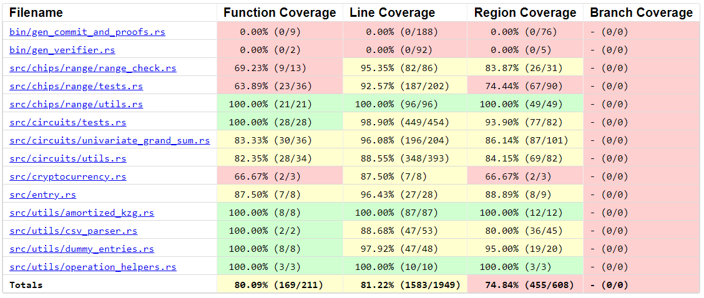

# Electisec Summa Review - KZG-based Protocol

Auditors:

- [0xkarl98](https://github.com/0xkarl98)
- [0xpanicError](https://github.com/0xpanicError)
- [parsely](https://github.com/bbresearcher)
- [flyingnobita](https://github.com/flyingnobita)
- [hrishibhat](https://github.com/hrishibhat)
- [igorline](https://github.com/igorline)
- [kiseln](https://github.com/kiseln)
- [nullity](https://github.com/nullity00)
- [obatirou](https://github.com/obatirou)
- [qpzm](https://github.com/qpzm)
- [rkdud007](https://github.com/rkdud007)
- [sachindkagrawal15](https://github.com/sachindkagrawal15)
- [sebastiantf](https://github.com/sebastiantf)
- [teddav](https://github.com/teddav/)
- [thogiti](https://github.com/thogiti)
- [Y5Yash](https://github.com/Y5Yash)
- [yagnadeepxo](https://github.com/yagnadeepxo)
- [zeroqn](https://github.com/zeroqn)

# Table of Contents

- [Protocol Summary](#protocol-summary)
  - [Overview of the Summa Proof of Solvency Protocol](#overview-of-the-summa-proof-of-solvency-protocol)
  - [Overview of the KZG-based Implementation of Summa Solvency (Version B)](#overview-of-the-kzg-based-implementation-of-summa-solvency-version-b)
- [Scope](#scope)
  - [Audit Objectives and Components](#audit-objectives-and-components)
  - [Scope of Files and Folders](#scope-of-files-and-folders)
  - [Methodology](#methodology)
- [Code Evaluation Matrix](#code-evaluation-matrix)
- [Automated testing](#automated-testing)
  - [Automated Analysis](#automated-analysis)
  - [Fuzz Testing](#fuzz-testing)
  - [Code Coverage](#code-coverage)
- [Findings](#findings)
  - [Findings Explanation](#findings-explanation)
  - [High](#high)
    - [1. High: Inclusion proof reveals whether a user holds a specific token](#1-high-inclusion-proof-reveals-whether-a-user-holds-a-specific-token)
    - [2. High: Incorrect verifying key contract permutation length can be considered valid by `validateVKPermutationsLength`](#2-high-incorrect-verifying-key-contract-permutation-length-can-be-considered-valid-by-validatevkpermutationslength)
    - [3. High: Fake user Inclusion Proof verified in contract](#3-high-fake-user-inclusion-proof-verified-in-contract)
    - [4. High: Missing username range check in `big_intify_username` & `big_uint_to_fp`](#4-high-missing-username-range-check-in-big_intify_username--big_uint_to_fp)
  - [Medium](#medium)
    - [1. Medium: `GrandSumVerifier.sol` - Revert if `ec_add_tmp` fails](#1-medium-grandsumverifiersol---revert-if-ec_add_tmp-fails)
  - [Low](#low)
    - [1. Low: Incorrect permutation length in `validateVKPermuationsLength`](#1-low-incorrect-permutation-length-in-validatevkpermuationslength)
    - [2. Low: CSV parsing allows duplicate crypto tokens](#2-low-csv-parsing-allows-duplicate-crypto-tokens)
    - [3. Low: The return value of GrandSumVerifier.verifyProof isn't tested](#3-low-the-return-value-of-grandsumverifierverifyproof-isnt-tested)
    - [4. Low: Range check tests are unreliable regarding the number of overflows](#4-low-range-check-tests-are-unreliable-regarding-the-number-of-overflows)
  - [Informational](#informational)
    - [1. Informational: `Summa.sol` - Missing validation in `timestamp` and bytes`(cryptocurrencies[i].chain).length`](#1-informational-summasol---missing-validation-in-timestamp-and-bytescryptocurrenciesichainlength)
    - [2. Informational: Update memory locations in verifiers to save gas](#2-informational-update-memory-locations-in-verifiers-to-save-gas)
    - [3. Informational: Dynamic Errors not handled in Box of Errors for Function Results](#3-informational-dynamic-errors-not-handled-in-box-of-errors-for-function-results)
    - [4. Informational: Use of unwrap in core files and improper error handling](#4-informational-use-of-unwrap-in-core-files-and-improper-error-handling)
    - [5. Informational: Using `abi.encodePacked()` saves gas](#5-informational-using-abiencodepacked-saves-gas)
- [Final remarks](#final-remarks)
- [Appendix](#appendix)
  - [A - Automated Analysis](#a---automated-analysis)
    - [1. Halo2-analyzer](#1-halo2-analyzer)
    - [2. Polyexen-demo](#2-polyexen-demo)
    - [3. Highlighter](#3-highlighter)
    - [4. NPM Audit](#4-npm-audit)
    - [5. Cargo Audit](#5-cargo-audit)
    - [6. Clippy](#6-clippy)
  - [B - Fuzz Testing](#b---fuzz-testing)
  - [C - Code Coverage](#c---code-coverage)

# Protocol Summary

## Overview of the Summa Proof of Solvency Protocol

Blockchain technology can facilitate uncensorable and self-sovereign control of one’s assets. Users nonetheless regularly transfer ownership of their assets to centralized entities for various needs, chief among which is trading of cryptocurrencies and the on/off-ramping of fiat. Such centralized entities may themselves and in turn transfer ownership to secondary specialized custodian entities or other service providers such as investment funds. Unfortunately, such centralized control and handling of user funds can lead to catastrophic situations such as the mishandling of private keys which may lead to internal or external hacks, or the outright misuse of funds for trading or for use as collateral to access capital -which can result in liquidations in extreme market conditions.

From the user's point of view, they only see a promise from the centralized entity that they hold their funds. But this only represents entries in an accounting database, and may or may not reflect the state of wallets that are under the control of the centralized entity. The perennial question is: are all user funds available and liquid for immediate withdrawal at a given moment in time?

Summa takes an approach that focuses on binding the custodian to a certain claim about the sum of their liabilities to their users, and subsequently leveraging zero-knowledge and cryptographic primitives to prove that the assets under their control are equal or exceed that sum of liabilities. In other words, rather than focusing on proving reserves, as in "we the entity control the private key(s) of wallets holding the pooled deposits of users", Summa focuses on binding liabilities, as in "we the entity prove to each user that their balance is included in calculating a grand sum of all liabilities, and we prove control of wallets that contain funds equal or exceeding that aggregated balance of liabilities".

Summa’s two-sided mechanism that overall provides a proof of solvency of an entity provides two useful proofs:

(a) **Proof of grand sums**: the centralized entity submits a public cryptographic [commitment](https://github.com/summa-dev/summa-solvency/blob/52373464b7ac4e76f7601cd51a10f84655ad387f/contracts/src/Summa.sol#L144) claiming the sum of each asset in wallets it controls is greater than or equal a _claimed_ total sum of _liabilities_ to its users in that asset. In the KZG-based Version B of the protocol, a [proof is attached](https://github.com/summa-dev/summa-solvency/blob/fec83a747ead213261aecfaf4a01b43fff9731ee/contracts/src/Summa.sol#L230) to the commitment attesting it was calculated correctly.

(b) **Inclusion proofs**: Multiple proofs to users, one for each user, that their exact balances were included in the calculation of the grand sum. The more users verify their individual proof of inclusion of their exact balances of each asset (a proof which is cryptographically tied to the overall proof in (a)), the more confidence there is that the _claimed_ total of liabilities used in (a) was truthful, thereby proving the solvency of the entity overall.

The more users verify their proof of inclusion in (b) the more trust the public at large can put in the proof of grand sums in (a). A custodian may incentivise wide verification of inclusion by users through the use of lottery where in each round of verification, say weekly or monthly, certain users are selected randomly to win a monetary reward.


Figure 1: General flow of the Summa protocol in both variants, _credit: [Enrico - Summa tech lead](https://docs.google.com/presentation/d/1xUcH8geMz6I1iD9Jx0kWsIZvUcVlii5Us3mM4Mb3HNg/edit#slide=id.p3)_

The proof in (a) further represents a trap-door commitment vis-à-vis the user who will verify their individual inclusion proofs against it. The zkSNARKs bring two benefits:

- **Privacy** against the leakage of user data. In verifying proofs of grand sums, the public input are the leaf and root hashes.
- **Validity** of the computation of aggregated balances.

The core of Summa protocol has been implemented in two variants that use different cryptographic primitives to generate the aforementioned proofs. However, the overall flow of the protocol (Figure 1) and assumptions and guarantees on security and privacy remain the same in both variants.

## Overview of the KZG-based Implementation of Summa Solvency (Version B)

The 2nd iteration of the Summa protocol aims to lower proving and verification costs while preserving the same privacy guarantees. The core primitive in this iteration of the protocol is a [cleverly](https://drive.google.com/drive/folders/1081DlyvigZykFaWmI3JCSknpnUEw0z67) [interpolated](https://drive.google.com/drive/folders/1k-8HDie_adueyjY0-TIhHaLawtT6p27d) polynomial that brings about performance efficiencies compared to the hashing-intensive MST in Version A. The overall flow of the protocol remains the same: the prover produces a proof of grand sum, and individual proofs of inclusion for each user. The reliance on large number of users verifying their inclusion proofs also remains, and the same privacy guarantees are also preserved.

A Lagrange basis polynomial is interpolated such that at `x=0` it evaluates to the grand sum of all liabilities (more precisely, the constant coefficient of the polynomial multiplied by the number of users = grand sum), while at `(w_j)^i` , where `w_j` is the `j-th` root of unity and `i` is a user-unique index, _it evaluates to the balance of the `i-th` user_. The construction takes advantage of the fact that the sum of roots of unity is zero in order to “encode” the desired evaluations into the polynomial.

The prover produces a commitment `C` to the polynomial and:

- An opening [proof](https://github.com/summa-dev/summa-solvency/blob/bd3a3d4d8fda6661e4eede00cf6176d66cb00858/prover/src/circuits/tests.rs#L167) at `x=0` to [the public](https://github.com/summa-dev/summa-solvency/blob/fec83a747ead213261aecfaf4a01b43fff9731ee/contracts/src/Summa.sol#L230)
- An opening proof at `(w_j)^i` for the `i-th` user, who can can verify inclusion not only that the evaluation is correct but also that the commitment `C` they evaluated against is the same as the public commitment.

# Scope

### Audit Objectives and Components

The security audit of the Summa Proof of Solvency protocol encompassed a comprehensive review aimed at enhancing the protocol’s security and reliability. Here are the streamlined objectives and components of the audit:

- **Codebase Security**: Evaluate source code to identify vulnerabilities, assess file organization, and ensure coding best practices.
- **Protocol Logic and Flow**: Analyze and verify the logical operations and data flows of the protocol for consistency and operational integrity.
- **Security Mechanisms**: Examine authentication, authorization, cryptographic practices, and smart contract security to bolster protocol defenses.
- **Zero-Knowledge Proof Assessment**: Critically evaluate the implementation of zero-knowledge proofs, focusing on algorithm efficiency, proof verification, and privacy safeguards.
- **Testing and Documentation**: Ensure thorough testing across all protocol components and review documentation for completeness and accuracy.

### Scope of Files and Folders

- **Commit hash**: [fec83a747ead213261aecfaf4a01b43fff9731ee](https://github.com/summa-dev/summa-solvency/tree/fec83a747ead213261aecfaf4a01b43fff9731ee)
- **Included**:
  - `/backend/*`
  - `/contracts/*`
  - `/csv/*`
  - `/prover/*` excluding [amortized KZG opening approach](https://github.com/summa-dev/summa-solvency/blob/fec83a747ead213261aecfaf4a01b43fff9731ee/prover/src/circuits/tests.rs#L31) and related code in [utils](https://github.com/summa-dev/summa-solvency/blob/fec83a747ead213261aecfaf4a01b43fff9731ee/prover/src/circuits/utils.rs#L236-L307)
- **Excluded**:
  - `/contracts/src/InclusionVerifier.sol`
  - Examples related to nova Experiments
  - `/src/circom/*`

### Methodology

The audit employed a blend of automated tools and manual examination conducted by the fellows and residents. Techniques included detailed code reviews, static and dynamic analysis, fuzzing, and penetration testing to ensure a thorough validation of the protocol’s security measures.

- **Tool Integration:**
  The audit utilized several specialized tools, each tailored to assess different aspects of the protocol:
  - **Halo2-analyzer**: Verified all circuit constraints.
  - **Polyexen-demo**: Standardized circuit formats for clarity and reusability.
  - **Misc Tools**: Utilized Highlighter to identify potential code issues, conducted NPM and Cargo Audits to check for vulnerabilities, and Clippy to ensure Rust code quality and best practices.
- **Analytical Techniques:**
  The audit encompassed both static and dynamic analyses to provide a comprehensive security assessment:
  - **Static Analysis**: Examined the source code for vulnerabilities without execution.
  - **Dynamic Analysis**: Tested the protocol in operation to identify runtime issues.
- **Expert Review:**
  We conducted in-depth manual reviews to evaluate complex components and integrations, providing a crucial layer of scrutiny beyond automated tools.
- **Feedback and Improvements:**
  An iterative feedback loop with the Summa’s development team allowed for the immediate addressing and re-evaluation of any issues found, ensuring all fixes were effectively implemented.
- **Documentation:**
  Each phase of the audit was thoroughly documented, with detailed reports on tool outputs, expert insights, and overall findings, culminating in a comprehensive final report that outlined vulnerabilities, impacts, and recommended actions.

After the findings were presented to the Summa team, fixes were made and included in several PRs.

This code review is for identifying potential vulnerabilities in the code. The reviewers did not investigate security practices or operational security and assumed that privileged parties could be trusted. The reviewers did not evaluate the security of the code relative to a standard or specification. The review may not have identified all potential attack vectors or areas of vulnerability.

Electisec and the auditors make no warranties regarding the security of the code and do not warrant that the code is free from defects. Electisec and the auditors do not represent or imply to third parties that the code has been audited nor that the code is free from defects. By deploying or using the code, Summa Solvency and users of the contracts/circuits agree to use the code at their own risk.

## Code Evaluation Matrix

---

| Category                 | Mark    | Description                                                                                                                                                                                                                                                                                                                                                                                                                                              |
| ------------------------ | ------- | -------------------------------------------------------------------------------------------------------------------------------------------------------------------------------------------------------------------------------------------------------------------------------------------------------------------------------------------------------------------------------------------------------------------------------------------------------- |
| Mathematics              | Good    | No significant mathematical components were involved                                                                                                                                                                                                                                                                                                                                                                                                     |
| Complexity               | Good    | The code is easy to understand and closely follows the specification                                                                                                                                                                                                                                                                                                                                                                                     |
| Libraries                | Low     | Although no serious issues have been found in the dependencies, the codebase makes use of unaudited versions of [halo2](https://github.com/summa-dev/halo2) , [halo2-kzg-srs](https://github.com/han0110/halo2-kzg-srs), and [halo2-solidity-verifier](https://github.com/summa-dev/halo2-solidity-verifier), which is not recommended for production                                                                                                    |
| Cryptography             | Good    | The codebase extensively relies on the binding & hiding properties of KZG Commitment Scheme. However, it's essential to note that cryptographic algorithms and functions are always subject to ongoing analysis, and new attacks or weaknesses may be discovered in the future.                                                                                                                                                                          |
| Code stability           | Good    | The code was reviewed at a specific commit. The code did not change during the review. Moreover, it is not likely to change significantly with the addition of features or updates                                                                                                                                                                                                                                                                       |
| Documentation            | Good    | Summa codebase comprises a centralized and up-to-date [Gitbook documentation](https://summa.gitbook.io/summa). However, we recommend aggregating the limitations and the attack vectors of the Summa Protocol in the documentation.                                                                                                                                                                                                                      |
| Monitoring               | N/A     | The protocol is intended to be integrated by other systems or dApps which will be responsible for the monitoring                                                                                                                                                                                                                                                                                                                                         |
| Testing and verification | Average | The protocol contains only a few tests for the circuits. It is recommended to add more tests to increase the test coverage. When it comes to circuits, we believe it is necessary to develop an adversarial testing process, especially focused on malicious prover behavior. We also recommend fuzz testing and incorporating tools we used in [Automated Testing](#automated-testing) in Summa's software development lifecycle to produce secure code |

# Automated testing

We use automated techniques to extensively test the security properties of software. We use both open-source static analysis and fuzzing utilities, along with tools developed in house, to perform automated testing of source code.

## Automated Analysis

We used the following tools in the automated testing phase of this project:

| Tool                                                                          | Description                                                                                                                                                                                                                                                           | Section                           |
| ----------------------------------------------------------------------------- | --------------------------------------------------------------------------------------------------------------------------------------------------------------------------------------------------------------------------------------------------------------------- | --------------------------------- |
| [Halo2-analyzer](https://github.com/quantstamp/halo2-analyzer)                | Halo2-analyzer / Korrekt employs a Satisfiability Modulo Theories (SMT) solver to try to find multiple satisfying models (i.e., private inputs) for a circuit and a (fixed) public input in order to determine if it is under-constrained.                            | [Appendix A.1](#1-halo2-analyzer) |
| [Polyexen-demo](https://github.com/ed255/polyexen-demo)                       | Polyexen (Polynomial Expression Engine) transforms circuits designed with the Halo2 API into the Plonkish Arithmetization Format (Plaf). Plaf is designed to standardize plonkish circuits for reuse in components compatible with plonkish arithmetization.          | [Appendix A.2](#2-polyexen-demo)  |
| [Highlighter](https://github.com/bbresearcher/ZK/tree/main/Halo2/Highlighter) | Highlighter is a python script which runs against a HALO2 (or Rust) project and will highlight any code that may need to be checked a bit closer                                                                                                                      | [Appendix A.3](#3-highlighter)    |
| [npm-audit](https://docs.npmjs.com/cli/v10/commands/npm-audit)                | `npm audit` scans your project's dependencies for known security vulnerabilities, reports them with severity levels, and suggests fixes. It helps keep your Node.js application secure by identifying and addressing potential risks in your packages.                | [Appendix A.3](#4-npm-audit)      |
| [cargo-audit](https://crates.io/crates/cargo-audit)                           | `cargo audit` scans your Rust project's dependencies for known security vulnerabilities, reports them with severity levels, and suggests fixes. It helps keep your Rust application secure by identifying and addressing potential risks in your crates.              | [Appendix A.4](#5-cargo-audit)    |
| [clippy](https://doc.rust-lang.org/clippy/)                                   | `clippy` is a linter for Rust that checks your code for common mistakes and style issues. It provides helpful suggestions to improve your code quality and maintainability. Using clippy helps ensure your Rust code is clean, efficient, and follows best practices. | [Appendix A.5](#5-cargo-audit)    |

## Fuzz Testing

Fuzz testing, also known as fuzzing, is an automated testing technique used to discover vulnerabilities and bugs in software.

We set up a fuzz test suite using Foundry for the smart contracts. [Appendix B](#b---fuzz-testing) contains a detailed description of the setup and deployment details.

## Code Coverage

We used [cargo-llvm-cov](https://github.com/taiki-e/cargo-llvm-cov) to generate LLVM source-based code coverage. Refer to [Appendix C](#c---code-coverage) for more detailed information on testing & code coverage.

# Findings

## Findings Explanation

Findings are broken down into sections by their respective Impact:

- Critical, High, Medium, Low Impact
  - These findings range from attacks that may cause loss of funds, a break in the soundness, zero-knowledge, or completeness of the system, proof malleability, or any unintended consequences/actions that are outside the scope of the requirements
- Informational
  - Findings including Recommendations and best practices

---

## High

## 1. High: Inclusion proof reveals whether a user holds a specific token

A sniffer can see whether a user has a specific token because balance polynomials are unblinded. A sniffer, for example, may be an web3 api endpoint who can see a user's inputs for `verifyInclusionProof`.

**Process**:

1. Assume $B(w^i) = 0$ and check $e([B(s)]_1 - [0]_1, [1]_2) == e([Q_B(w^i)]_1, [s]_2 - [w^i]_2)$
2. If it is true, the user does not have the token. If It is false, the user has the token.

**How to know each term:**

1. $[B(s)]_1$ is the commitment stored in the contract through `submitCommitment` by a prover.
2. $[Q_B(w^i)]_1$ is given by the verifier as an input for `verifyInclusionProof`.
3. The index of a user $i$ can be known by a rainbow table trick. It calculates $[s]_{2}- [w^i]_2$ for every i and compare with the challenge input given in `verifyInclusionProof`.

#### Refer

- [The inclusion proof reveals whether a user holds a specific token](https://github.com/zBlock-2/summa-solvency/issues/21) by [qpzm](https://github.com/qpzm)

## 2. High: Incorrect verifying key contract permutation length can be considered valid by `validateVKPermutationsLength`

The function `validateVKPermutationsLength` is used to validate the number of permutations in the verifying key contract corresponds to the circuit used to generate proof for the number of cryptocurrencies the custodian committed to. The Summa contract assumes that permutations commitments begins at bytes `0x2e0` in the `vKContract` ([source](https://github.com/zBlock-2/summa-solvency/blob/fec83a747ead213261aecfaf4a01b43fff9731ee/contracts/src/Summa.sol#L151)).

This can lead to vkContracts with different permutation commitments from the circuit used by the custodian wrongfully considering valid. A simple case would be a verifying contract with 2 fixed commitments but one permutation commitment less than the one being used. In this case, all others things being equals, the permutations commitments would not begin at bytes `0x2e0` but at `0x0320`. As the length of the bytes of the contracts are still equals due to one permutation in less, `validateVKPermutationsLength` would consider this vkcontract valid which is incorrect.

#### Refer

- [Wrong verifying key contract permutation length can be considered valid by `validateVKPermutationsLength`](https://github.com/zBlock-2/summa-solvency/issues/10) by [obatirou](https://github.com/obatirou)

## 3. High: Fake user Inclusion Proof verified in contract

The use of blinded advice column for username allows for the verification of a non-existing user's (the user id is out of the bounds of the original CSV file with all balances set to 0) inclusion proof in the smart contract.

As all the cell values are zero, it might not be a critical issue in the CEX use case of proof of liability, but this becomes critical issue when Summa’s core logic is utilized in more [general application use cases](https://eprint.iacr.org/2021/1350.pdf) where inclusion itself plays an important role.

#### Refer

- [Fake user Inclusion Proof verified in contract](https://github.com/zBlock-2/summa-solvency/issues/9) by [rkdud007](https://github.com/rkdud007), [qpzm](https://github.com/qpzm)

## 4. High: Missing username range check in `big_intify_username` & `big_uint_to_fp`

```rust
/// Return a BigUint representation of the username
pub fn big_intify_username(username: &str) -> BigUint {
    let utf8_bytes = username.as_bytes();
    BigUint::from_bytes_be(utf8_bytes)
}
/// Converts a BigUint to a Field Element
pub fn big_uint_to_fp(big_uint: &BigUint) -> Fp {
    Fp::from_str_vartime(&big_uint.to_str_radix(10)[..]).unwrap()
}
```

A malicious prover could create usernames that overflow if two users have the same balance thus they can exclude one of the records from the data.

We recommend that a range check is done inside the circuit or inside the smart contract. The range checks are to ensure that all usernames were less than the SNARK scalar field order so that two users don't end up with the same identity in the polynomial.

#### Refer

- [Username overflow](https://github.com/zBlock-2/summa-solvency/issues/2) by [parsely](https://github.com/bbresearcher)
- [Possible Overflow in username in big_intify_username combined with calling big_uint_to_fp](https://github.com/zBlock-2/summa-solvency-diffie/issues/16) by [parsely](https://github.com/bbresearcher)
- [Guarantee usernames stays inside field](https://github.com/zBlock-2/summa-solvency-schneier/issues/13) by [sebastiantf](https://github.com/sebastiantf)

## Medium

## 1. Medium: `GrandSumVerifier.sol` - Revert if `ec_add_tmp` fails

The return value of the [elliptic curve point addition](https://github.com/summa-dev/summa-solvency/blob/fec83a747ead213261aecfaf4a01b43fff9731ee/contracts/src/GrandSumVerifier.sol#L143-L144) is not checked in the `verify_proof` function. To fix this, we recommend adding a `revert` statement.

```diff
    success := ec_add_tmp(success, lhs_x, lhs_y)
+   if iszero(success) {
+       revert(0, 0)
+   }
```

Furthermore, [`verifyProof`](https://github.com/summa-dev/summa-solvency/blob/fec83a747ead213261aecfaf4a01b43fff9731ee/contracts/src/GrandSumVerifier.sol#L32) function is missing the `view` modifier

```diff
-    ) public returns (bool) {
+    ) public view returns (bool) {
```

#### Refer

- [The return value of `GrandSumVerifier` should be tested](https://github.com/zBlock-2/summa-solvency/issues/4) by [qpzm](https://github.com/qpzm)

## Low

## 1. Low: Incorrect permutation length in `validateVKPermuationsLength`

In `Summa.sol`, when computing [`numPermutations`](https://github.com/summa-dev/summa-solvency/blob/fec83a747ead213261aecfaf4a01b43fff9731ee/contracts/src/Summa.sol#L147-L149), it is assumed that `balanceByteRange / 2` range check columns are required. When the `balanceByteRange` is set to 9, it is expected to have four 2^16 lookup tables plus an additional 2^8 or 2^16 lookup table. But, `balanceByteRange / 2` returns 4, which is incorrect.

To Reproduce this, [change `balanceByteRange` to 9](https://github.com/summa-dev/summa-solvency/blob/v2/contracts/test/Summa.ts#L43) and the test should fail.

#### Refer

- [Incorrect permutation length in `validateVKPermuationsLength`](https://github.com/zBlock-2/summa-solvency/issues/6) by [zeroqn](https://github.com/zeroqn)

## 2. Low: CSV parsing allows duplicate crypto tokens

The CSV parsing function and code allows for the CSV import to contain duplicate crypto tokens. This does not have any security impact, however, it is best to restrict columns to be unique.

**To Reproduce**: Use any csv data as shown below

```
username,balance_ETH_ETH,balance_ETH_ETH
dxGaEAii,11888,41163
MBlfbBGI,67823,18651
```

Running the command `cargo run --release --example summa_solvency_flow` still generates the CSV successfully.

```
1. Ownership proofs are submitted successfully!
2. Commitment is submitted successfully!
3. Exported proof to user #1, as `user_1_proof.json`
4. Verifying the proof on contract veirifer for User #1: true
```

#### Refer

- [CSV parsing allows duplicate crypto tokens](https://github.com/zBlock-2/summa-solvency/issues/5) by [parsely](https://github.com/bbresearcher)

## 3. Low: The return value of `GrandSumVerifier.verifyProof` isn't tested

The [Verifier Test File](https://github.com/summa-dev/summa-solvency/blob/fec83a747ead213261aecfaf4a01b43fff9731ee/contracts/test/Verifiers.ts#L96) only checks if the function is not reverted. It does not check for the `bool` returned by `verifyProof`

To fix this, it is recommended to test the return value

```diff
-       expect(await grandSumVerifier.verifyProof(verifyingKey.address, proofs, totalBalances)).to.be.not.reverted;
+       expect(await grandSumVerifier.verifyProof(verifyingKey.address, proofs, totalBalances)).to.be.true;
```

#### Refer

- [The return value of `GrandSumVerifier` should be tested](https://github.com/zBlock-2/summa-solvency/issues/4)

## 4. Low: Range check tests are unreliable regarding the number of overflows

This [test data](https://github.com/summa-dev/summa-solvency/blob/fec83a747ead213261aecfaf4a01b43fff9731ee/csv/entry_16_overflow.csv) has two entries which exceed 2^64 -1:

```
1. user0 balance0
2. user1 balance1
```

The test result, however, shows that 4 balances break the range check.

For example, user2 balance0 is zero, but the test error contains `Perform range check on balance 0 of user 2`. Refer to the assertion [here](https://github.com/summa-dev/summa-solvency/blob/fec83a747ead213261aecfaf4a01b43fff9731ee/prover/src/circuits/tests.rs#L453-L484)

#### Refer

- [Range check tests are unreliable regarding the number of overflows](https://github.com/zBlock-2/summa-solvency/issues/3) by [qpzm](https://github.com/qpzm) , [rkdud007](https://github.com/rkdud007)

## Informational

## 1. Informational: `Summa.sol` - Missing validation in `timestamp` and `bytes(cryptocurrencies[i].chain).length`

```js
function submitCommitment(
    bytes calldata snarkProof,
    bytes calldata grandSumProof,
    uint256[] memory totalBalances,
    uint256 timestamp // @audit : Future timestamp can be used. This can be used to manipulate
```

`timestamp` is expected to be the time at which the exchange has taken snapshot of all the balances but this `timestamp` is not validated. This may lead to potential manipulations by the exchange owner by combining off-chain and on-chain processes.

- Inconsistencies/confusion by not maintaining a chronological order in the commitment.
- Delaying the proof verification by promising a future commitment.

To mitigate this, add the following validation checks to the timestamp :

- Add a check to ensure the timestamp is not in the future.
- Store the last submitted timestamp and check the new timestamp is larger than the previous timestamp.

```diff
+ uint256 public lastSubmitted;

    function submitCommitment(
        bytes calldata snarkProof,
        bytes calldata grandSumProof,
        uint256[] memory totalBalances,
        uint256 timestamp
    ) public onlyOwner {
        // Check input length
        require(totalBalances.length > 0, "Invalid total balances length");
        require(
            grandSumProof.length == (totalBalances.length * 0x40),
            "Invalid grand sum proof length"
        );
+       require(timestamp < block.timestamp, "Cannot submit future commitment");
+       require(timestamp > lastSubmitted, "Incorrect timestamp");
+       lastSubmitted = timestamp;
        ....
```

The following sanity check `require(bytes(cryptocurrencies[i].chain).length <= config.cryptocurrencyChains.length, "Cryptocurrency chain mismatch");` is missing for currencies in a chain.

#### Refer

- [Security concerns in `Summa.sol`](https://github.com/zBlock-2/summa-solvency/issues/23) by [hrishibhat](https://github.com/hrishibhat)

## 2. Informational: Update memory locations in verifiers to save gas

Verifier contracts specify memory addresses to load constants from the trusted setup.
It starts from `0x220` in [GrandSumVerifier](https://github.com/summa-dev/summa-solvency/blob/fec83a747ead213261aecfaf4a01b43fff9731ee/contracts/src/GrandSumVerifier.sol#L12) and from `\0x200` in [InclusionVerifier](https://github.com/summa-dev/summa-solvency/blob/fec83a747ead213261aecfaf4a01b43fff9731ee/contracts/src/InclusionVerifier.sol#L11).
However, it can start from `0x180`.

The maximum memory size used in both verifiers is `0x180`, so it is recommended to save constants from memory `0x180` as demonstrated in [PR#19](https://github.com/zBlock-2/summa-solvency/pull/19). The saved memory is 160 and 128 bytes respectively.

#### Refer

- [Update memory locations in verifiers to save gas](https://github.com/zBlock-2/summa-solvency/issues/18) by [qpzm](https://github.com/qpzm) and [rkdud007](https://github.com/rkdud007)
- [Verifier(GrandSumVerifier.sol and InclusionVerifier.sol) fixes](https://github.com/zBlock-2/summa-solvency/pull/19) by [qpzm](https://github.com/qpzm) and [rkdud007](https://github.com/rkdud007)

## 3. Informational: Dynamic Errors not handled in Box of Errors for Function Results

When `Box` pointer is used on function returning a result, the underlying error type is only known at runtime and not statically known. There are instances in code where `Box` is used but there is no handling of dynamic errors in the function.

#### Refer

- [Dynamic Errors not handled in Box of Errors for Function Results](https://github.com/zBlock-2/summa-solvency/issues/8) by [sachindkagrawal15](https://github.com/sachindkagrawal15)

## 4. Informational: Use of unwrap in core files and improper error handling

Unwrap is usually a shortcut to bypass implementing proper error handling in Rust. Using Unwrap in production code is not recommended as it crashes the application & hides actual bugs. It is highly undesirable in core files and is a Rust bad practice. Proper error handling/transmission should be implemented.

#### Refer

- [Use of unwrap in core files and improper error handling](https://github.com/zBlock-2/summa-solvency/issues/7) by [sachindkagrawal15](https://github.com/sachindkagrawal15)

## 5. Informational: Using `abi.encodePacked()` saves gas

Using `abi.encodePacked()` reduces deployments gas from 1961848 to 1915414 as demonstrated in [PR#11](https://github.com/zBlock-2/summa-solvency/pull/11)

#### Refer

- [perf: use abi.encodePacked()](https://github.com/zBlock-2/summa-solvency/pull/11) by [sebastiantf](https://github.com/sebastiantf)

## Final remarks

- The Summa Solvency Protocol assumes that :
  - Poseidon hash function is collision-resistant, resistant to differential, algebraic, and interpolation attacks.
  - The KZG commitment scheme is completely binding & hiding with homomorphic properties
- Social engineering attacks are still a valid way to break the system. The custodian could omit a section of users who do not verify their inclusion proofs.
- The library used for trusted setup - [halo2-kzg-srs](https://github.com/han0110/halo2-kzg-srs) is unaudited & it's contents are unreliable as there is no checksum available to validate its contents
- The security of the circuit depends on the security of the cryptographic primitives such as KZG Commitments. Some of the known pitfalls of KZG include :
  - The usage of small order elements leading to compromised security
  - Recovery of polynomials using Polynomial interpolation when all t+1 points are exposed
- Overall, the code demonstrates good implementation of mathematical operations and basic functionality. However, it could benefit from more extensive documentation, testing and additional tools such as [polyexen](https://github.com/zBlock-2/summa-solvency-diffie/pull/5) to view cell data.

# Appendix

## A - Automated Analysis

### 1. Halo2-analyzer

Halo2-analyzer / Korrekt employs a Satisfiability Modulo Theories (SMT) solver to try to find multiple satisfying models (i.e., private inputs) for a circuit and a (fixed) public input in order to determine if it is under-constrained. It works by collecting all the gates and regions using a custom implementation (`AnalyticLayouter`) of the `Layouter` trait. For every `region`, we have a set of enabled selectors and assigned cells (but with dummy values), likewise for every `gate`, we have a set of polynomials for each gate. This simple tool performs three checks :

- **Unused Gate -** Check that for every gate there exists a region in which it is not identically zero.
- **Unused Column -** Check that every column occurs in some polynomial.
- **Unconstrained Cell -** Check that for every assigned cell in the region, it occurs in a polynomial which is not identically zero over this region. This means that part of the witness is not constrained -- this is almost certainly a bug.

We used halo2-analyzer to search for unused gates, unconstrained cells and unused columns in the circuits. Here are the results :

#### 1. Unused Gate

```bash
Finished analysis: 0 unused gates found.
```

#### 2. Unused columns

```bash
Finished analysis: 5 unused columns found.
unused column: Column { index: 2, column_type: Advice }
unused column: Column { index: 3, column_type: Advice }
unused column: Column { index: 4, column_type: Advice }
unused column: Column { index: 5, column_type: Advice }
unused column: Column { index: 1, column_type: Advice }
```

- This is due to the balances being 0. Hence, a false positive.

#### 3. Unconstrained Cells

```bash
Finished analysis: 12 unconstrained cells found.
unconstrained cell in "assign entries to the table" region: Column { index: 1, column_type: Advice } (rotation: 0) -- very likely a bug.
unconstrained cell in "assign entries to the table" region: Column { index: 0, column_type: Advice } (rotation: 0) -- very likely a bug.
unconstrained cell in "assign entries to the table" region: Column { index: 0, column_type: Advice } (rotation: 0) -- very likely a bug.
unconstrained cell in "assign entries to the table" region: Column { index: 1, column_type: Advice } (rotation: 0) -- very likely a bug.
unconstrained cell in "Perform range check on balance 0 of user 0" region: Column { index: 2, column_type: Advice } (rotation: 0) -- very likely a bug.
unconstrained cell in "Perform range check on balance 0 of user 0" region: Column { index: 5, column_type: Advice } (rotation: 0) -- very likely a bug.
unconstrained cell in "Perform range check on balance 0 of user 0" region: Column { index: 3, column_type: Advice } (rotation: 0) -- very likely a bug.
unconstrained cell in "Perform range check on balance 0 of user 0" region: Column { index: 4, column_type: Advice } (rotation: 0) -- very likely a bug.
unconstrained cell in "Perform range check on balance 0 of user 1" region: Column { index: 2, column_type: Advice } (rotation: 0) -- very likely a bug.
unconstrained cell in "Perform range check on balance 0 of user 1" region: Column { index: 3, column_type: Advice } (rotation: 0) -- very likely a bug.
unconstrained cell in "Perform range check on balance 0 of user 1" region: Column { index: 4, column_type: Advice } (rotation: 0) -- very likely a bug.
unconstrained cell in "Perform range check on balance 0 of user 1" region: Column { index: 5, column_type: Advice } (rotation: 0) -- very likely a bug.
```

Here's the complete [report](https://github.com/electisec/summa-audit-report/blob/main/appendix/V2/Halo2-analyzer/output.md)

### 2. Polyexen-demo

Polyexen (Polynomial Expression Engine) transforms circuits designed with the Halo2 API into the Plonkish Arithmetization Format (Plaf). Plaf is designed to standardize plonkish circuits for reuse in components compatible with plonkish arithmetization. The current implementation supports serializing a Plaf circuit into two parts:

- A CSV file containing the fixed column values.
- A TOML file encompassing the rest of the circuit definition, including:
  - Lookup constraints
  - Gate constraints
  - Copy constraints

We used polyexen-demo to debug the assignments & double check the constraints. Here’s the output :

- Fixed Columns - [CSV](https://github.com/electisec/summa-audit-report/blob/main/appendix/V2/Polyexen/ugc_fixed.csv)
- Lookup constraints - [ugc_lookups.toml](https://github.com/electisec/summa-audit-report/blob/main/appendix/V2/Polyexen/ugc_lookups.toml)
- Gate constraints - [ugc_polys.toml](https://github.com/electisec/summa-audit-report/blob/main/appendix/V2/Polyexen/ugc_polys.toml)
- Copy constraints - [ugc.toml](https://github.com/electisec/summa-audit-report/blob/main/appendix/V2/Polyexen/ugc.toml)

### 3. Highlighter

Highlighter is a python script which runs against a HALO2 (or Rust) project and will highlight any code that may need to be checked a bit closer

Highlighter works on a set of rules to look for error prone areas such as incorrect endianness, improper use of `unwrap`, finding `TODO` comments which might signify incomplete code, overflows & underflows. Here's the complete [report](https://github.com/electisec/summa-audit-report/blob/main/appendix/V2/Highlighter/output.md) of the findings by Highlighter.

### 4. NPM Audit

`npm audit` scans your project's dependencies for known security vulnerabilities, reports them with severity levels, and suggests fixes. It helps keep your Node.js application secure by identifying and addressing potential risks in your packages. View the complete report of security vulnerabilities in the `contracts` package [here](https://github.com/electisec/summa-audit-report/blob/main/appendix/V2/npm-audit/output.md)

### 5. Cargo Audit

`cargo audit` scans your Rust project's dependencies for known security vulnerabilities, reports them with severity levels, and suggests fixes. It helps keep your Rust application secure by identifying and addressing potential risks in your crates. View the complete report of security vulnerabilities in `prover` and `backend` [here](https://github.com/electisec/summa-audit-report/blob/main/appendix/V2/cargo-audit/output.md).

### 6. Clippy

`clippy` is a linter for Rust that checks your code for common mistakes and style issues. It provides helpful suggestions to improve your code quality and maintainability. Using `clippy` helps ensure your Rust code is clean, efficient, and follows best practices. Here's the [report](https://github.com/electisec/summa-audit-report/blob/main/appendix/V2/clippy/output.md).

## B - Fuzz Testing

Fuzz testing, also known as fuzzing, is an automated testing technique used to discover vulnerabilities and bugs in software.

In the context of smart contracts, fuzz testing involves providing invalid, unexpected, or random data as inputs to the smart contract's functions to see how they behave under stress and to identify potential security vulnerabilities or unexpected behaviors.

We used Foundry to generate fuzz tests for the smart contracts as specified in this [PR#1](https://github.com/zBlock-2/summa-solvency/pull/1/commits/2b3b3150835c7821fa62206b3b15ee9ebd1790c9#diff-fd578f7055e92d1627d1766c1de70e56e929946494bdd590cc146ad808e7e34f)

## C - Code Coverage

We used [cargo-llvm-cov](https://github.com/taiki-e/cargo-llvm-cov) to generate LLVM source-based code coverage. Click [here](https://clang.llvm.org/docs/SourceBasedCodeCoverage.html#interpreting-reports) for information about interpreting this report.


